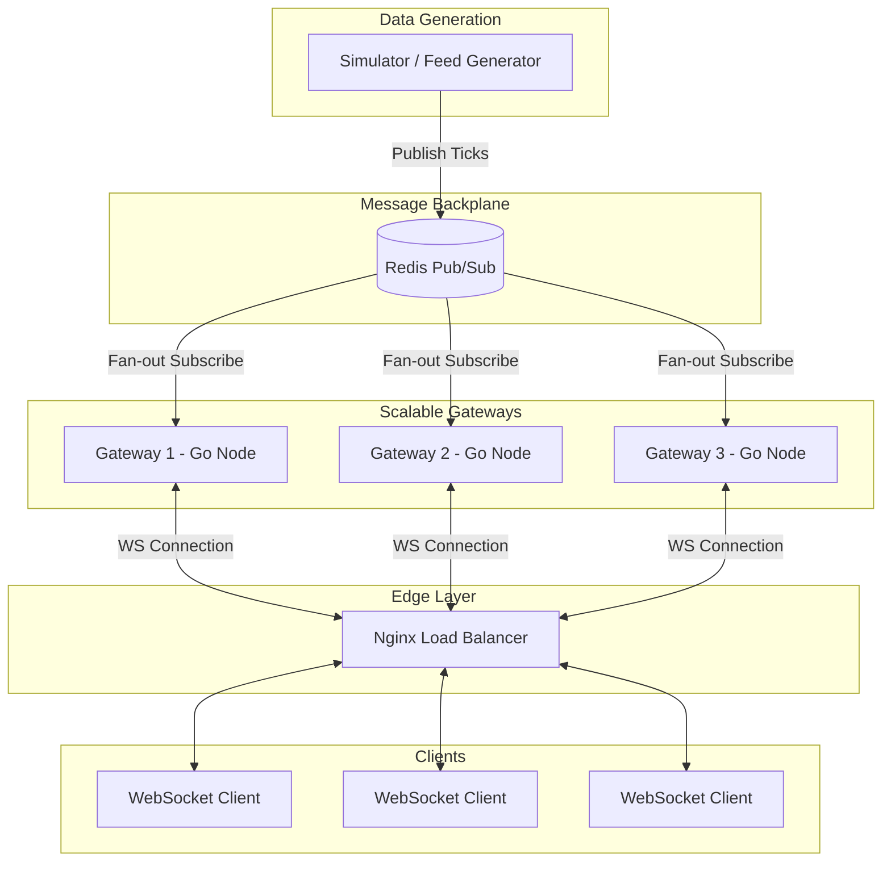

# Real-Time Market Data System: Architecture & Feature Overview

## 1. Executive Summary
The Real-Time Market Data System is a production-grade, highly concurrent distributed platform built in Go. It is designed to simulate, process, and broadcast high-frequency financial market data (e.g., stock ticks) to thousands of concurrent clients in real-time. 

Beyond standard pub/sub message broadcasting, the system features a complex, deterministic **Replay Engine** that allows administrators and clients to pause, resume, and seek through historical data feeds with sub-millisecond precision. The entire platform is horizontally scalable, containerized, and heavily optimized for low-latency memory management.

---

## 2. System Architecture
The platform is built on a distributed fan-out architecture designed to prevent any single point of failure and to allow horizontal scaling of WebSocket connections.

### The Data Flow:
1. **Producer:** One gateway acts as the primary feed generator, simulating high-frequency stock ticks.
2. **Backplane:** The producer publishes the ticks to a Redis Pub/Sub channel.
3. **Consumers:** Multiple replica gateways subscribe to the Redis channel, receiving the market data in real-time.
4. **Broadcast:** The replica gateways fan the data out to their locally connected WebSocket clients.
5. **Load Balancing:** Nginx sits at the edge, distributing incoming WebSocket connections evenly across all available gateways.

---

## 3. Core Features & Components

### A. High-Frequency Market Data Simulator
Instead of relying on an external paid API for testing, the system includes a robust internal market data simulator.
* **Configurable Ticks:** Generates randomized, realistic price movements using geometric Brownian motion principles.
* **Burst/Benchmark Mode:** Capable of generating hundreds of thousands of ticks per second (100-microsecond intervals) for stress-testing the architecture.

### B. Scalable WebSocket Gateways
The Go backend gateways manage the complex lifecycle of long-lived WebSocket connections.
* **Stateless Design:** Gateways do not store global client states, allowing them to be scaled up or killed without affecting the wider system.
* **Connection Pooling:** Gracefully manages client connect/disconnect events, preventing memory leaks from zombie connections.
* **Service Discovery:** Gateways dynamically register themselves, making horizontal scaling a plug-and-play operation.

### C. The Replay Engine (Advanced Feature)
The crown jewel of the system is the Replay Engine, which allows time-travel debugging and historical playback of market data.
* **Deterministic State Machine:** A mathematically rigorous state machine handles transitions between `Init`, `Playing`, `Paused`, `Completed`, and `Failed` states.
* **Thread-Safe Controls:** Provides APIs to `Pause()`, `Resume()`, and `Seek()` the data feed. 
* **Concurrency Guardrails:** Ensures that concurrent control requests (e.g., two users hitting Pause at the exact same millisecond) do not cause data races or corrupt the replay state.

---

## 4. Performance & Concurrency Optimizations
To handle high-frequency trading (HFT) style workloads, the system incorporates advanced Go memory and concurrency patterns.

* **`sync.Pool` for Zero-Allocation JSON:** Market data ticks are highly repetitive. Instead of allocating new memory for every JSON serialization, the system uses `sync.Pool` to recycle byte buffers. This drastically reduces Garbage Collection (GC) pauses, keeping latency flat.
* **Bounded Worker Pools:** Instead of spawning a new goroutine for every single message or task, the system uses bounded worker pools. This prevents CPU thrashing and out-of-memory (OOM) crashes under extreme loads.
* **`sync.RWMutex` over standard Mutex:** Read-heavy structures (like checking the current replay state) use Read-Write locks. This allows thousands of concurrent reads without blocking the thread, only enforcing an exclusive lock when the state is actively changing.
* **Graceful Context Cancellation:** Deeply integrated `context.Context` usage ensures that when a client disconnects or a node shuts down, all associated goroutines are cleanly terminated, preventing goroutine leaks.

---

## 5. Deployment & Testing 
The repository is designed to be immediately deployable and verifiable.

* **Dockerized Fleet:** The entire stack (Redis, Nginx, Multiple Gateways) is orchestrated via Docker Compose.
* **Automated Integration Benchmarks:** Includes a bash-driven stress testing suite that spins up the 5-gateway cluster, ramps up thousands of WebSocket clients, and validates throughput capacity.
* **Race Detection:** Unit tests are heavily validated using the Go race detector (`-race`) to ensure the concurrent state machine is completely thread-safe.

---

## 6. Conclusion
The Real-Time Market Data System is a comprehensive showcase of distributed systems engineering. It bridges the gap between raw backend performance (Go, zero-allocation memory, concurrency) and scalable infrastructure (Redis, Nginx, Docker). By successfully implementing a deterministic replay state machine across a distributed fan-out architecture, it proves high capabilities in modern backend software engineering.
