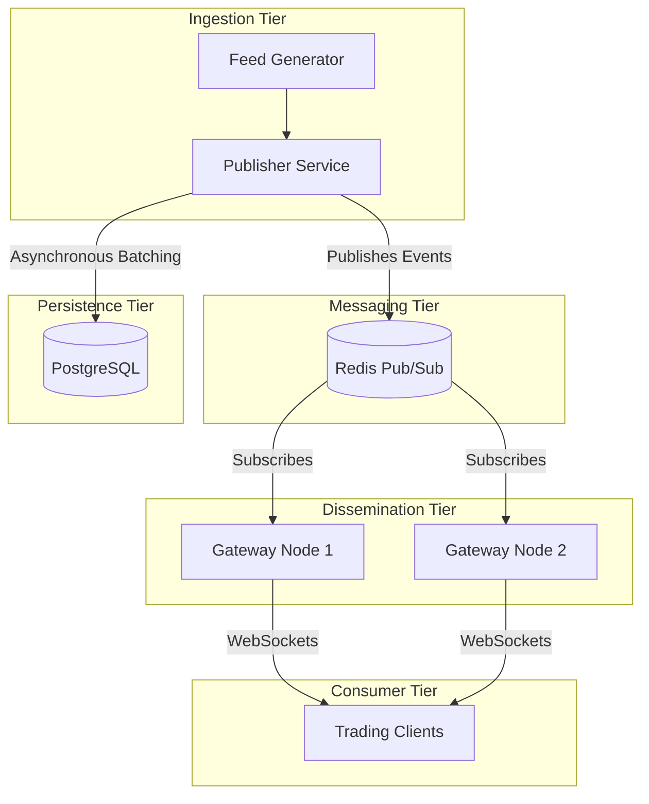

# Component Architecture

**Purpose:** To detail the structural breakdown of the RTMDS platform, explaining the boundaries and responsibilities of each microservice.
**Intended Audience:** Backend Engineers, System Architects, DevOps.
**Maintenance Strategy:** Must be updated synchronously with any Pull Request that introduces a new service or fundamentally alters an existing service's boundary.

---

## 1. Architectural Topology

The RTMDS platform follows an event-driven microservices architecture. It strictly decouples the ingestion of data (Publisher) from the dissemination of data (Gateway).

## 2. Component Responsibilities

### 2.1 Feed Generator
- **Role:** Simulates an upstream financial exchange.
- **Responsibility:** Generates high-velocity, structurally valid market data ticks (JSON payloads) and pushes them to the Publisher.

### 2.2 Publisher Service
- **Role:** The ingress boundary.
- **Responsibility:** Validates incoming market data, attaches monotonically increasing sequence numbers and OpenTelemetry trace context, and routes the data to the correct Redis topic. It is also responsible for asynchronously persisting the raw events to PostgreSQL for historical retention.

### 2.3 Gateway Service
- **Role:** The egress boundary.
- **Responsibility:** Maintains stateful WebSocket connections with end clients. It subscribes to Redis topics on behalf of connected clients and fans out the market data packets in real time. It is entirely stateless, allowing infinite horizontal scaling.

### 2.4 Topic Manager
- **Role:** Routing logic.
- **Responsibility:** Dynamically maps financial instruments (e.g., `AAPL`, `BTC/USD`) to underlying Redis channels, abstracting the physical messaging topology from the Publisher and Gateway logic.
- **Algorithm:** Uses a consistent hashing ring to distribute thousands of high-velocity topics evenly across a Redis cluster, preventing hot-key memory starvation on a single shard.

### 2.5 Snapshot & Replay Services (Historical)
- **Role:** Recovery and Initialization.
- **Responsibility:** Serves REST API requests for point-in-time state (Snapshots) and historical sequences (Replay) by querying the PostgreSQL event store.
