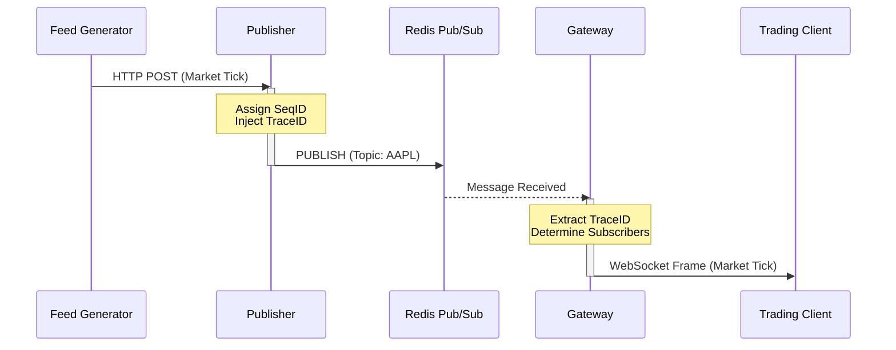
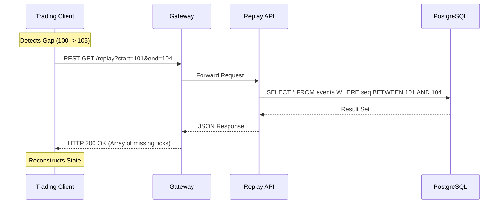
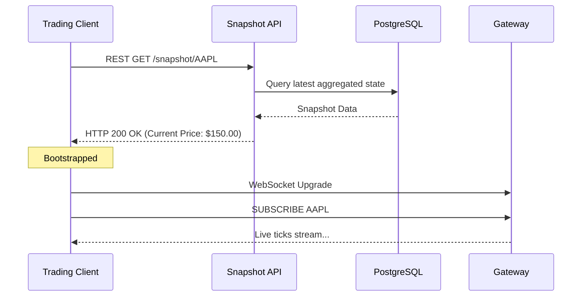

# Data Flow Architecture

**Visual Diagram:** [Market Data Flow Diagram](../diagrams/architecture/MARKET_DATA_FLOW_DIAGRAM.md)

**Purpose:** To illustrate the step-by-step movement of a market data packet through the RTMDS platform.
**Intended Audience:** Backend Engineers, Integration Engineers.
**Maintenance Strategy:** Must be updated if the routing mechanism (Redis) or connection protocol (WebSocket) is fundamentally changed.

---

## 1. Live Market Data Dissemination Flow

The primary hot path of the system is designed to minimize latency. 

## 2. Recovery (Replay) Flow

When a client detects a sequence gap (e.g., received sequence `105`, but the last known sequence was `100`), they must request a historical replay.

## 3. Snapshot Initialization Flow

When a client boots up at the start of the day, it uses the Snapshot API to get the current state before subscribing to the live feed.

