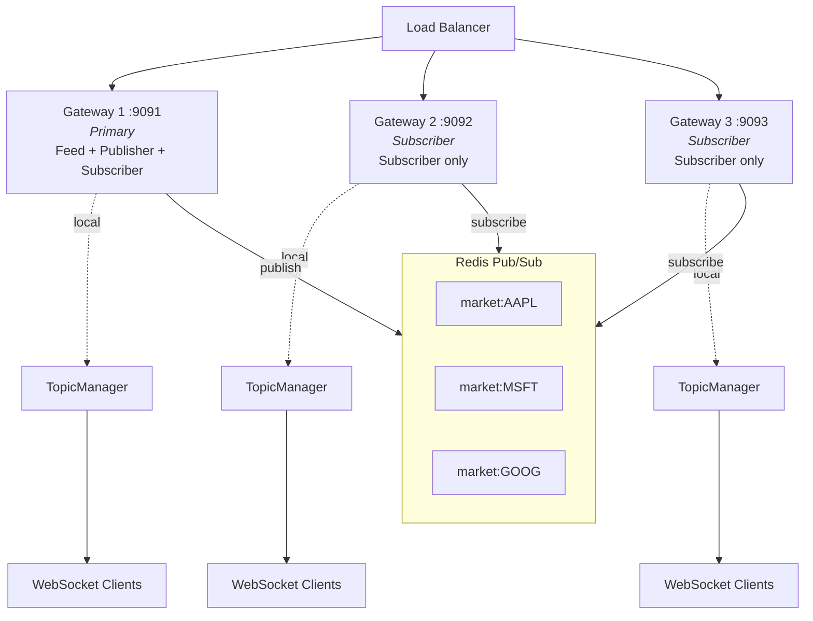

# Horizontally Scalable WebSocket Gateway Architecture
## Real-Time Market Data Platform

### Author

Principal Distributed Systems Engineer

### Goal

Design a WebSocket Gateway architecture capable of supporting:

- Multiple gateway instances
- WebSocket clients
- Redis Pub/Sub backend
- Horizontal scaling
- High availability

Target scale:

```text
50,000 Concurrent Connections
```

Current architecture:

```text
Feed Generator
      ↓

Publisher
      ↓

Redis Pub/Sub
      ↓

WebSocket Gateway
      ↓

Clients
```

Target architecture:

```text
                    Feed Generator
                           ↓

                       Publisher
                           ↓

                    Redis Pub/Sub
                           ↓

      ┌──────────────────────────────────────┐
      │                                      │
      ▼                                      ▼

+---------------+                    +---------------+
| Gateway #1    |                    | Gateway #2    |
+---------------+                    +---------------+

      ▲                                      ▲
      │                                      │

      └──────────── Load Balancer ───────────┘
                           ▲
                           │

                    WebSocket Clients
```

---

# 1. Why Horizontal Scaling?

## Problem

A single gateway eventually reaches limits.

Example:

```text
5000 Clients
```

works comfortably.

But:

```text
50000 Clients
```

introduces:

```text
CPU Saturation

Memory Pressure

Network Bottlenecks

File Descriptor Limits
```

Eventually one machine becomes the bottleneck.

---

## Goal

Distribute connections across many gateway instances.

Instead of:

```text
50000 Clients
      ↓
Gateway #1
```

Use:

```text
50000 Clients
      ↓

Gateway #1

Gateway #2

Gateway #3

Gateway #N
```

This allows capacity to grow by adding servers.

---

# 2. High-Level Architecture

```text
                    Feed Generator
                           ↓

                       Publisher
                           ↓

                    Redis Pub/Sub
                           ↓

     +-----------+-----------+-----------+
     |           |           |           |
     ↓           ↓           ↓           ↓

 Gateway 1   Gateway 2   Gateway 3   Gateway N

     ↓           ↓           ↓           ↓

 WebSocket   WebSocket   WebSocket   WebSocket
 Clients     Clients     Clients     Clients
```

Each gateway operates independently.

Redis distributes market updates.

---

# 3. Gateway Responsibilities

The gateway should only handle:

```text
Connection Management

Client Authentication

Subscriptions

Message Delivery

Backpressure Enforcement
```

The gateway should NOT handle:

```text
Market Data Generation

Persistence

Replay

Business Logic
```

Keep gateways lightweight.

---

# 4. Gateway Internal Architecture

```text
                 Redis Subscriber
                        ↓

                  Topic Manager
                        ↓

             Per-Subscriber Queues
                        ↓

                Connection Manager
                        ↓

                  WebSocket Clients
```

Responsibilities:

### Redis Subscriber

Receives market updates.

### Topic Manager

Tracks local subscriptions.

### Connection Manager

Tracks active clients.

### Client Queues

Protect system from slow consumers.

---

# 5. Load Balancing

A load balancer sits in front of gateways.

Architecture:

```text
Clients
    ↓

Load Balancer
    ↓

Gateway Pool
```

Purpose:

```text
Distribute Connections

Health Checks

Traffic Routing
```

---

# 6. Load Balancing Strategies

## Round Robin

Example:

```text
Client 1 → Gateway 1

Client 2 → Gateway 2

Client 3 → Gateway 3
```

Advantages:

```text
Simple

Even Distribution
```

Disadvantages:

```text
Ignores Current Load
```

---

## Least Connections

Example:

```text
Gateway 1
1000 Clients

Gateway 2
800 Clients

Gateway 3
500 Clients
```

New client:

```text
Assigned To Gateway 3
```

Advantages:

```text
Better Load Distribution
```

Disadvantages:

```text
Slightly More Complex
```

---

## Consistent Hashing

Example:

```text
Client ID
      ↓

Hash
      ↓

Gateway Selection
```

Advantages:

```text
Sticky Routing

Predictable Placement
```

Disadvantages:

```text
Rebalancing Complexity
```

---

# Recommended Strategy

For WebSockets:

```text
Least Connections
```

provides the best balance.

---

# 7. Connection Distribution

Target:

```text
50000 Connections
```

Example deployment:

```text
10 Gateway Instances
```

Result:

```text
5000 Connections Per Gateway
```

---

## Benefits

Memory distributed across servers.

Instead of:

```text
50,000 Connections
One Machine
```

Use:

```text
5,000 Connections
Per Machine
```

Much easier to manage.

---

# 8. Connection Lifecycle

## Step 1

Client connects.

```text
Client
      ↓
Load Balancer
      ↓
Gateway
```

---

## Step 2

Gateway accepts connection.

Creates:

```text
Client State

Subscription Registry

Outbound Queue
```

---

## Step 3

Client subscribes.

```text
SUBSCRIBE AAPL
```

Gateway updates:

```text
Local Topic Manager
```

---

## Step 4

Market updates arrive.

```text
Redis
      ↓
Gateway
      ↓
Topic Manager
      ↓
Client Queue
      ↓
WebSocket
```

---

# 9. Redis Integration

Each gateway subscribes to Redis channels.

Example:

```text
market:equities

market:crypto

market:forex
```

---

## Message Flow

```text
Publisher
      ↓

Redis Channel
      ↓

Gateway 1

Gateway 2

Gateway N
```

Every gateway receives updates.

Local filtering determines delivery.

---

# 10. Local Subscription Routing

Gateway maintains:

```text
Topic
    →
Subscribers
```

Example:

```text
AAPL
    →
Client1
Client5
Client9
```

When update arrives:

```text
AAPL Update
```

Gateway routes only to:

```text
Client1

Client5

Client9
```

---

# 11. Scaling Strategy

## Initial Deployment

```text
2 Gateways
```

Capacity:

```text
10,000 Connections
```

---

## Growth

Add servers.

```text
4 Gateways
```

Capacity:

```text
20,000 Connections
```

---

## Further Growth

```text
10 Gateways
```

Capacity:

```text
50,000 Connections
```

No application redesign required.

---

# 12. Stateless Gateway Design

Gateways should remain stateless.

Store only:

```text
Active Connections

Subscriptions

Buffers
```

No persistent state.

---

## Why?

Benefits:

```text
Easy Scaling

Easy Replacement

Fast Recovery
```

If a gateway dies:

```text
Launch New Instance
```

No data migration needed.

---

# 13. Failure Scenario: Gateway Crash

Example:

```text
Gateway #4
```

fails.

Result:

```text
Connected Clients Disconnect
```

Only affected clients reconnect.

Other gateways remain healthy.

---

## Recovery

```text
New Gateway Instance
```

joins cluster.

Load balancer starts routing traffic.

---

# 14. Failure Scenario: Redis Outage

Redis unavailable.

Effects:

```text
No New Market Updates
```

Connections remain active.

Clients stay connected.

Data distribution pauses.

---

## Mitigation

Use:

```text
Redis Sentinel

Redis Cluster

Managed Redis
```

for high availability.

---

# 15. Failure Scenario: Slow Consumers

Some clients cannot keep up.

Example:

```text
10000 Updates/sec

Client Processes
100 Updates/sec
```

Result:

```text
Queue Growth
```

---

## Protection

Use:

```text
Per-Client Buffers

Bounded Queues

Disconnect Policy
```

to protect gateway resources.

---

# 16. Resource Planning

## Memory

Assume:

```text
5000 Connections
Per Gateway
```

Each connection:

```text
Connection State

Buffers

Subscriptions
```

Memory planning becomes predictable.

---

## CPU

Main consumers:

```text
Message Routing

Serialization

Network Writes
```

Monitor:

```text
CPU Utilization

Queue Depth

Message Rate
```

---

# 17. Gateway Metrics

Track:

```text
websocket_active_connections

websocket_messages_sent_total

websocket_messages_dropped_total

gateway_subscription_count

gateway_queue_depth

gateway_publish_latency_seconds
```

---

# 18. Recommended Production Architecture

```text
                    Feed Generator
                           ↓

                       Publisher
                           ↓

                    Redis Pub/Sub
                           ↓

          +-------------------------------+
          |                               |
          ▼                               ▼

      Gateway Pool (Stateless Instances)

   +---------+  +---------+  +---------+
   |   GW1   |  |   GW2   |  |   GWN   |
   +---------+  +---------+  +---------+

          ▲         ▲             ▲
          │         │             │

      Load Balancer (Least Connections)

          ▲
          │

      50,000 WebSocket Clients
```

---

# Tradeoffs

| Design Choice | Benefit | Cost |
|--------------|----------|------|
| Single Gateway | Simpler | Limited Scale |
| Multiple Gateways | Horizontal Scale | More Infrastructure |
| Round Robin LB | Simple | Uneven Load |
| Least Connections LB | Better Distribution | Slight Complexity |
| Stateless Gateways | Easy Scaling | Rebuild State On Reconnect |
| Redis Pub/Sub | Low Latency | No Persistence |
| Redis Cluster | High Availability | Operational Complexity |

---

# Final Recommendation

For a real-time market data platform targeting:

```text
50,000 Concurrent Connections
```

Recommended architecture:

```text
Redis Pub/Sub
+
Stateless Gateway Instances
+
Least Connections Load Balancer
+
Local Topic Managers
+
Per-Subscriber Buffers
```

Key characteristics:

```text
Horizontal Scalability

Gateway Independence

Fault Isolation

Linear Capacity Growth

Low Latency Delivery

Operational Simplicity
```

This architecture is commonly used as the intermediate scaling stage before moving toward larger event-streaming systems such as Redis Streams, Apache Kafka, or NATS JetStream.

---

# Quick Start

## Prerequisites

- Docker and Docker Compose installed
- Ports 9091, 9092, 9093, and 6379 available

## Launch

```bash
# From the project root
docker compose -f docker-compose.multigateway.yml up --build -d
```

This starts:

| Service | Port | Role |
|---------|------|------|
| Redis | 6379 | Pub/Sub message bus |
| Gateway 1 | 9091 | Primary — runs feed generator, publishes to Redis |
| Gateway 2 | 9092 | Subscriber — receives from Redis, serves clients |
| Gateway 3 | 9093 | Subscriber — receives from Redis, serves clients |

Or use the Makefile shortcut:

```bash
make gw-up
```

## Verify Health

```bash
# Check all gateways
curl http://localhost:9091/health
curl http://localhost:9092/health
curl http://localhost:9093/health

# Or use Makefile
make gw-health
```

Expected output:

```json
{"status":"ok"}
```

## Detailed Component Status

```bash
curl http://localhost:9091/health/detail   # Primary — shows feed-generator, pipeline, redis-publisher, redis-subscriber
curl http://localhost:9092/health/detail   # Subscriber — shows redis-subscriber only
```

## Test WebSocket Clients

Connect with any WebSocket client:

```bash
# Using wscat (npm install -g wscat)
wscat -c ws://localhost:9091/ws
wscat -c ws://localhost:9092/ws
wscat -c ws://localhost:9093/ws
```

Subscribe to symbols by sending a JSON message after connecting:

```json
{"action":"subscribe","symbols":["AAPL","MSFT"]}
```

You will receive live trade data:

```json
{"type":"trade","payload":{"symbol":"AAPL","type":"trade","price":198.42,"bid":198.40,"ask":198.44,"volume":100,"time":"2026-06-24T07:00:00Z"}}
```

## Verify Multi-Gateway Data Flow

All three gateways receive the same market data from Redis. Connect to any gateway and subscribe — you will get identical data regardless of which gateway you connect to.

```bash
# Terminal 1 — connect to gateway 1
wscat -c ws://localhost:9091/ws
> {"action":"subscribe","symbols":["AAPL"]}

# Terminal 2 — connect to gateway 2
wscat -c ws://localhost:9092/ws
> {"action":"subscribe","symbols":["AAPL"]}

# Both receive the same AAPL trade data
```

## View Logs

```bash
# All gateways
docker compose -f docker-compose.multigateway.yml logs -f

# Specific gateway
docker logs rtmds-gateway1 -f
docker logs rtmds-gateway2 -f
docker logs rtmds-gateway3 -f

# Or use Makefile
make gw-logs
```

## Tear Down

```bash
docker compose -f docker-compose.multigateway.yml down -v

# Or use Makefile
make gw-down
```

## Run Tests

Redis Pub/Sub unit tests (uses isolated channel prefixes):

```bash
docker compose -f docker-compose.dev.yml up -d redis
docker compose -f docker-compose.dev.yml run --rm dev go test -race -count=1 -v ./internal/distribution/redisbus/...
```

Or use the Makefile:

```bash
make dev-test-redis
```

## Configuration

Each gateway is configured via environment variables in `docker-compose.multigateway.yml`:

| Variable | Gateway 1 | Gateway 2 | Gateway 3 | Description |
|----------|-----------|-----------|-----------|-------------|
| `RTMDS_SERVER_PORT` | 9091 | 9092 | 9093 | HTTP/WebSocket listen port |
| `RTMDS_REDIS_ENABLED` | true | true | true | Enable Redis Pub/Sub |
| `RTMDS_REDIS_ADDR` | redis:6379 | redis:6379 | redis:6379 | Redis connection address |
| `RTMDS_FEED_ENABLED` | true | false | false | Run feed generator |
| `RTMDS_FEED_SYMBOLS` | AAPL,MSFT,... | AAPL,MSFT,... | AAPL,MSFT,... | Symbols to stream |

Key point: only the primary gateway (gateway1) runs the feed generator. Subscriber gateways receive data from Redis.

## Architecture Diagram

