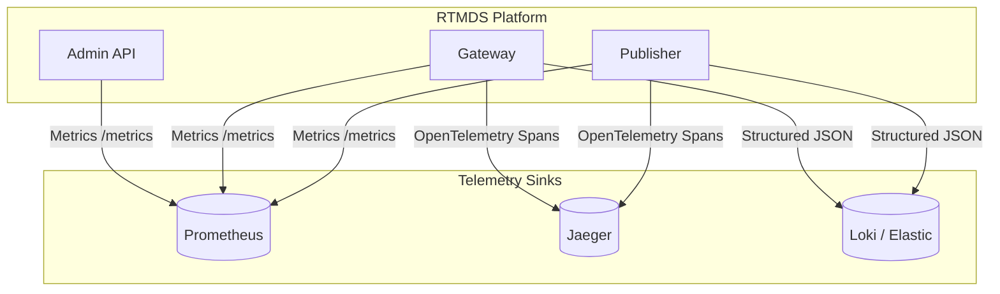

# Observability Architecture

**Visual Diagram:** [Observability Pipeline Diagram](../diagrams/architecture/OBSERVABILITY_PIPELINE_DIAGRAM.md)

**Purpose:** To define how the system emits, collects, and visualizes telemetry (logs, metrics, and traces).
**Intended Audience:** Site Reliability Engineers, Platform Engineers.
**Maintenance Strategy:** Must be updated if the underlying telemetry backends (Prometheus, Jaeger, Loki) are swapped or upgraded.

---

## 1. Observability Pillars

The RTMDS platform utilizes a modern observability stack designed to answer "why is the system slow?" and "where did the packet drop?"

## 2. Distributed Tracing (Jaeger / OpenTelemetry)

To correlate an incoming tick from the Feed Generator all the way down to the WebSocket delivery, we utilize W3C Trace Context.
- **Trace Generation:** The `Publisher` generates a root `TraceID` and `SpanID` the millisecond it receives a tick.
- **Context Propagation:** The `TraceID` is serialized into the JSON payload and published to Redis.
- **Trace Continuations:** The `Gateway` deserializes the JSON, extracts the `TraceID`, and creates a child span representing the network dispatch to the WebSocket client.

This allows engineers to open Jaeger and visually see the exact millisecond cost of every hop in the infrastructure.

## 3. Metrics (Prometheus)

All Go services expose a standard `/metrics` endpoint on an isolated administrative HTTP port. 
Key metrics tracked:
- **Throughput:** `rtmds_events_published_total`
- **Latency:** `rtmds_http_request_duration_seconds` (Histograms)
- **Saturation:** `rtmds_websocket_connections_active`
- **Errors:** `rtmds_errors_total`

## 4. Structured Logging (Zap)

All application logs are strictly emitted as JSON using Uber's `zap` library. 
- **Contextual Logging:** Every log MUST include the `trace_id` and `component` fields.
- **Audit Logging:** Administrative actions (e.g., pausing the Publisher) are written to a dedicated, high-durability audit log file, bypassing standard application log sampling rules.
