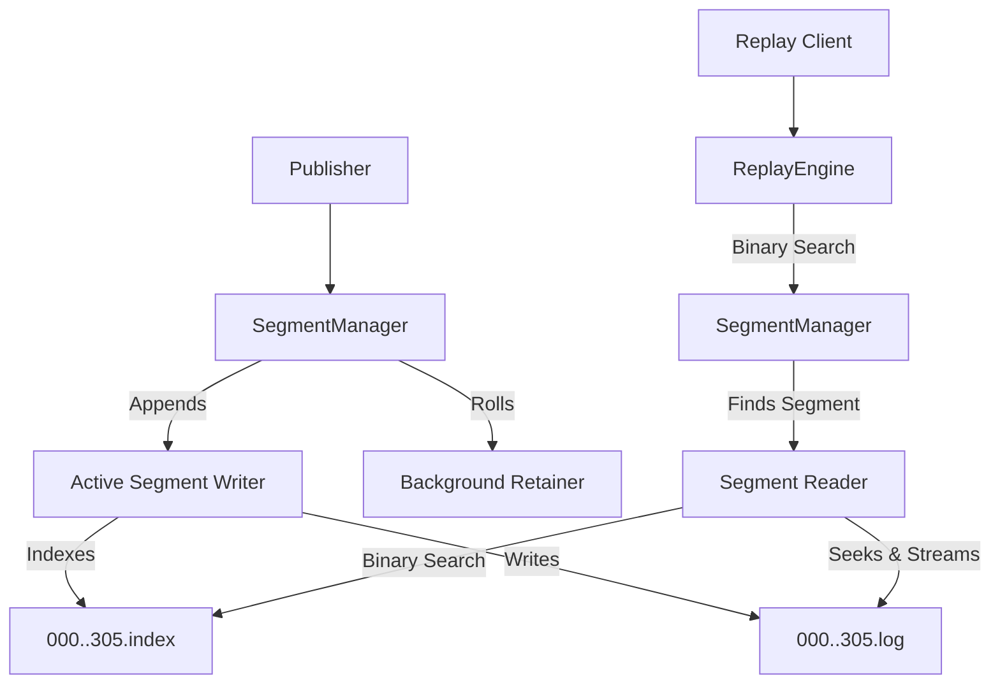

# Production-Grade WAL Architecture
*By: Staff Engineer*

## 1. Executive Summary
To elevate the current single-file Write Ahead Log (WAL) to a production-grade distributed messaging tier, we must shift to a **Segmented Log Architecture** paired with a **Sparse Index**. This design guarantees bounded memory usage, `O(log N)` search for fast replay (`ResumeFrom`), efficient background garbage collection (log retention), and rapid recovery times.

---

## 2. Storage Layout

The persistence tier will be organized into a partition directory. Each partition consists of a series of segments. A segment is a pair of files: a `.log` file (the data) and an `.index` file (the sparse index).

```text
/data/wal/
└── market_events/
    ├── 00000000000000000000.log    # Closed segment
    ├── 00000000000000000000.index  # Index for segment 0
    ├── 00000000000001502394.log    # Closed segment
    ├── 00000000000001502394.index  # Index for segment 1502394
    ├── 00000000000003050123.log    # Active segment (appends go here)
    └── 00000000000003050123.index  # Active index
```
* **Naming Convention**: The filename is the 20-digit zero-padded `Sequence Number` of the very first message contained in the segment.

---

## 3. Architecture & Component Responsibilities



### 3.1 `SegmentManager`
- **Role**: Coordinates the active segment and all historical (closed) segments.
- **Responsibility**: Routes appends to the active segment. Evaluates when the active segment reaches the threshold (`MaxSegmentBytes`) and performs an atomic segment roll.

### 3.2 `SegmentWriter`
- **Role**: Handles binary encoding, CRC calculation, and memory-mapped or buffered IO writes.
- **Responsibility**: Sequentially appends messages to the `.log` file. Every `IndexIntervalBytes` (e.g., 4KB), it appends an entry to the `.index` file containing `[Relative Sequence Number (4B)] -> [Physical Byte Offset (4B)]`.

### 3.3 `SegmentReader`
- **Role**: Executes fast lookup and sequential reading.
- **Responsibility**: Opens a memory-mapped `.index` file, executes a binary search to find the closest physical byte offset before the requested `ResumeFrom` sequence, seeks the `.log` file to that offset, and streams forward sequentially.

### 3.4 `Background Retainer`
- **Role**: Enforces log retention policies.
- **Responsibility**: Periodically wakes up, scans the list of closed segments, and permanently deletes `.log` and `.index` files older than `RetentionTime` or exceeding `RetentionBytes`.

---

## 4. Data Flow

### 4.1 Write Flow (Segment Rolling)
1. Message arrives at `SegmentManager`.
2. Manager grabs an `RLock` on the active segment and calls `Append()`.
3. If `activeSegment.Bytes > MaxSegmentBytes`:
   - Manager acquires `Lock()`.
   - Flushes and closes the current `.log` and `.index`.
   - Creates a new active segment where the filename is the sequence of the new message.
   - Appends the message to the new segment.

### 4.2 Fast Replay Flow (`ResumeFrom: N`)
1. Client requests `ResumeFrom: X`.
2. `SegmentManager` iterates through its loaded segments in-memory (e.g., `0`, `1500`, `3000`). It finds the segment where `BaseOffset <= X` and `NextSegmentBaseOffset > X`.
3. The chosen `SegmentReader` memory-maps the `.index` file.
4. It performs an `O(log N)` binary search on the index to find the highest sequence `<= X`, retrieving its physical byte offset in the `.log`.
5. The reader seeks the `.log` file descriptor to the physical offset.
6. The reader sequentially scans forward, skipping messages `< X`, until it hits exactly `X`, then begins streaming to the client.

---

## 5. API Contracts (Interfaces)

```go
// SegmentManager coordinates segment rolling and lookups.
type Log interface {
    Append(msg *Message) (offset uint64, err error)
    NewReader(startSequence uint64) (LogReader, error)
    Close() error
}

// LogReader is a stateful iterator for streaming replays.
type LogReader interface {
    Next() (*Message, error)
    Close() error
}

// Segment represents a single Log/Index file pair.
type Segment interface {
    Append(msg *Message) (offset uint64, err error)
    ReadAt(seq uint64) (LogReader, error)
    BaseSequence() uint64
    Size() int64
    Close() error
    Remove() error
}
```

---

## 6. Snapshots

To prevent unbounded startup times for consumers joining brand new streams, the system can leverage a **Snapshotting Engine**:
- A background worker sequentially reads the WAL and maintains an in-memory materialized view (e.g., the Latest Quote for every symbol).
- Every configured interval, it serializes this state to a `snapshot_XYZ.bin` file.
- **New clients** do not start from Sequence 0. They fetch the latest Snapshot, which contains the exact state at sequence `S`. They then begin their WAL replay requesting `ResumeFrom: S + 1`.

---

## 7. Recovery Sequence & Restart

### 7.1 Minimal Startup Time
1. `SegmentManager` lists all files in `/data/wal/market_events/`.
2. It parses the filenames and sorts them numerically to reconstruct the segment list.
3. For all closed segments, it only loads the base sequence from the filename into memory. It does **not** read the files.
4. It opens the *latest* segment (the one with the highest filename sequence).
5. It memory-maps the latest `.index` file to instantly discover the highest committed sequence number.
6. If the node previously crashed, the last few bytes of the active `.log` may be torn. The Manager seeks to the offset of the last known good index entry, scans forward sequentially verifying CRC32 checksums, and truncates any torn bytes at the tail.

**Result**: Startup time is nearly `O(1)` regardless of whether the WAL holds 1GB or 1PB of historical data.

---

## 8. Failure Scenarios

| Scenario | Mitigation |
| :--- | :--- |
| **Process Crash / Power Loss** | The active `.log` may have un-flushed bytes. Upon restart, the recovery sequence verifies CRC32 checksums at the tail. Torn bytes are safely truncated. Flushed data is safe. |
| **Disk Exhaustion** | The `Background Retainer` strictly enforces `RetentionBytes`. If disk is filling rapidly, the system safely deletes the oldest segments atomically. Replay clients requesting purged sequences receive an `ErrSequenceTooOld` and must fall back to Snapshots. |
| **Corrupted Index File** | If an `.index` is corrupted or lost, the system can completely rebuild it by sequentially scanning the corresponding `.log` file in a background thread. |

---

## 9. Tradeoff Discussion

- **Index Granularity (Sparse vs Dense)**:
  - *Dense Index*: Every message gets an index entry. `O(1)` exact seek. High memory footprint for index files.
  - *Sparse Index* (Chosen): Index every 4KB of data. Drastically lower memory footprint. Seek takes you to the general neighborhood (4KB block), then you must linearly scan. At high throughputs, a 4KB scan is sub-millisecond, making this an ideal tradeoff.
- **Fsync Strategies**:
  - *Sync Every Append*: Safest, but bounds throughput to disk IOPS (e.g., ~1,000 IOPS on standard SSDs). 
  - *Async Sync* (Chosen): Buffer writes in userspace (`bufio`) or page cache (`mmap`), and trigger `fdatasync` every 100ms. Allows hundreds of thousands of messages per second. The tradeoff is a worst-case loss of 100ms of data on complete power loss.
- **Message Types**:
  - Currently, standard events are passed. Using flatbuffers or protobufs as the standard encoding layout across the wire and disk would eliminate CPU overhead during replay since zero-copy streaming (`sendfile`) could be used.
