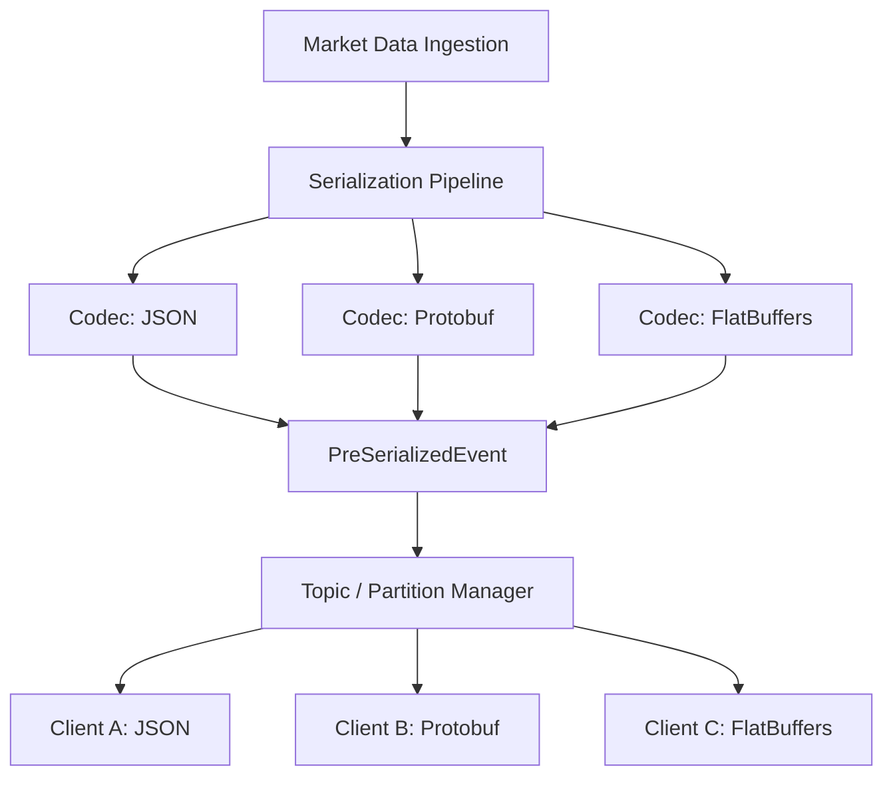

# Protocol Layer Architecture Design

As a Staff Engineer focusing on the networking tier, this document outlines the design for a high-performance, multi-format protocol layer for the market data platform. The design prioritizes zero-allocation data paths, "serialize-once" broadcast mechanics, and seamless protocol negotiation to support JSON, Protocol Buffers, and FlatBuffers simultaneously.

## 1. Architecture Overview

To achieve extreme low latency and minimize GC pressure, the networking layer will transition from a "per-client serialization" model to a **"Pre-Serialized Broadcast"** model.



## 2. Protocol Negotiation

Clients must explicitly negotiate their desired format and version during the initial WebSocket handshake using the standard HTTP `Sec-WebSocket-Protocol` header.

**Client Request:**
```http
GET /ws HTTP/1.1
Host: api.rtmds.internal
Upgrade: websocket
Connection: Upgrade
Sec-WebSocket-Protocol: v1.flatbuffers.rtmds, v1.protobuf.rtmds, v1.json.rtmds
```

**Gateway Response:**
The Gateway selects the most optimal protocol supported by both the server and client (prioritizing binary formats) and replies:
```http
HTTP/1.1 101 Switching Protocols
Upgrade: websocket
Connection: Upgrade
Sec-WebSocket-Protocol: v1.flatbuffers.rtmds
```
*Note: If the client does not specify a protocol, the Gateway defaults to `v1.json.rtmds` for broad compatibility, or rejects the connection if strict mode is enabled.*

## 3. Serialization Pipeline (Serialize Once)

To satisfy the "serialize once whenever possible" requirement, the pipeline uses a `PreSerializedEvent`. Instead of passing Go structs to clients and having each client marshal the data, the system marshals the data exactly once per required format.

### API Contracts
```go
// Format represents a wire protocol
type Format uint8
const (
    FormatJSON Format = iota
    FormatProtobuf
    FormatFlatBuffers
)

// PreSerializedMessage holds immutable, pre-computed byte slices.
type PreSerializedMessage interface {
    // Payload returns the raw bytes for a specific format.
    // Must return an error if the format wasn't pre-computed.
    Payload(format Format) ([]byte, error)
    
    // Retain increments the reference count (for pooling).
    Retain()
    
    // Release decrements the reference count and returns memory to the pool.
    Release()
}

// Codec defines the contract for serializing internal domain events.
type Codec interface {
    Format() Format
    Encode(event *domain.MarketEvent, buf *bytes.Buffer) error
}
```

### The "Lazy/Active" Serialization Optimization
The `CodecManager` tracks which formats are actively requested by currently connected clients. 
- If 10,000 clients are connected, but *none* negotiated JSON, the JSON Codec is bypassed entirely.
- The pipeline only serializes formats that have >0 active subscribers on that specific gateway.

## 4. Message Lifecycle & Allocation Minimization

To achieve near-zero allocations (Requirement #5), the message lifecycle utilizes `sync.Pool` heavily:

1. **Ingest**: A raw `domain.MarketEvent` arrives.
2. **Buffer Allocation**: The `CodecManager` pulls byte buffers from a `sync.Pool`.
3. **Marshal**:
   - **JSON**: Uses `easyjson` or `ffjson` for zero-reflection, static byte appending.
   - **Protobuf**: Uses `proto.MarshalAppend` into the pooled buffer.
   - **FlatBuffers**: Uses a pooled `flatbuffers.Builder` (inherently zero-allocation).
4. **Broadcast**: A `PreSerializedMessage` wrapper is constructed holding pointers to the pooled buffers. Its reference count is set to `len(Subscribers)`.
5. **Network Write**: Each client's goroutine fetches its specific byte slice via `msg.Payload(c.format)` and writes it directly to the WebSocket via `ws.WriteMessage`.
6. **Cleanup**: As each client finishes writing, it calls `msg.Release()`. When the ref-count hits 0, the underlying buffers are returned to the `sync.Pool`.

## 5. Package Structure

```text
internal/
└── protocol/
    ├── codec.go          # Core interfaces (Codec, PreSerializedMessage)
    ├── manager.go        # CodecManager, lazy formatting, sync.Pool management
    ├── negotiation.go    # HTTP header parsing and subprotocol selection
    └── v1/
        ├── domain.go     # V1 Data models
        ├── json/         # Code-generated JSON encoders (easyjson)
        ├── pb/           # Generated Protobuf bindings (*.pb.go)
        └── fb/           # Generated FlatBuffers bindings (*.go)
```

## 6. Versioning Strategy & Backward Compatibility

**Schema Evolution (Requirement #7):**
- **Protobuf**: Highly compatible. Never change existing field tags. Add new fields at the end. Use optional fields.
- **FlatBuffers**: Conceptually similar to Protobuf. Append new fields to the end of tables. Never delete fields; mark them as `deprecated` to prevent reuse of their vtable slots.
- **JSON**: Safest fallback. Ignore unknown fields on parse. Omit empty fields (omitempty) to save bandwidth.

**Protocol Versioning (Requirement #6):**
The version is baked into the WebSocket subprotocol (`v1.protobuf.rtmds`).
When V2 is released (e.g., a major restructuring of the order book event):
1. Both V1 and V2 codecs are registered in the `CodecManager`.
2. V1 clients negotiate `v1.*.rtmds`. V2 clients negotiate `v2.*.rtmds`.
3. The Gateway translates the internal `domain.MarketEvent` into both V1 and V2 representations seamlessly. 

## 7. Tradeoffs & Considerations

> [!WARNING]
> **Memory Overhead vs. CPU Cycles**
> Pre-serializing to 3 different formats consumes 3x the memory per event in the broadcast queues. This trades slightly higher memory utilization for a massive reduction in CPU cycles (O(1) serialization instead of O(N) where N is clients). Given market data is highly fanned-out, this is the correct tradeoff.

> [!TIP]
> **FlatBuffers Client Constraints**
> FlatBuffers requires clients to read directly from memory offsets. While this is incredibly fast in C++/Rust/Go, web clients (JavaScript) may find FlatBuffers clunky compared to JSON or Protobuf. Supporting JSON remains critical for browser-based debugging and simple integrations.

> [!IMPORTANT]
> **Reference Counting Complexity**
> Implementing a strict `Retain()`/`Release()` model in Go requires extreme discipline to avoid premature buffer recycling or memory leaks. `defer msg.Release()` must be strictly enforced in the client write loops.
