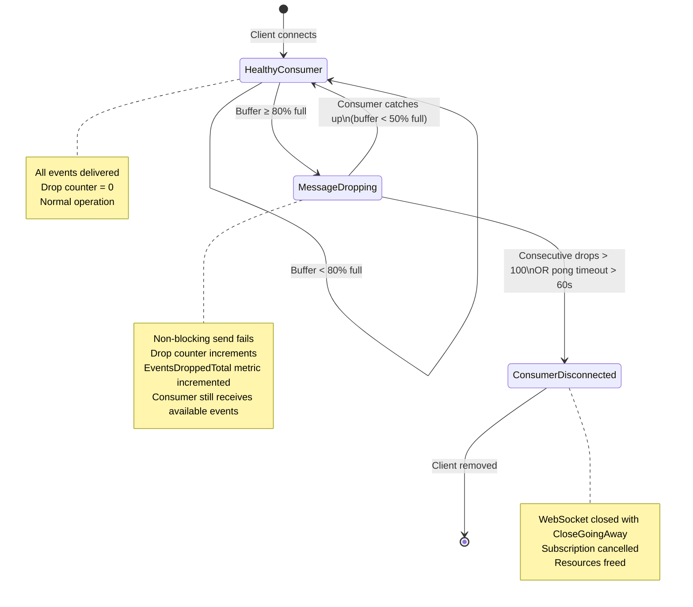

# Backpressure Strategy Analysis

## Real-Time Market Data Distribution System

---

## Scenario

| Parameter | Value |
|-----------|-------|
| Producer rate | 10,000 messages/sec |
| Consumer rate | 100 messages/sec |
| Buffer ratio deficit | 100:1 |

Every slow consumer falls behind by ~9,900 messages/sec. Without backpressure, memory grows unbounded, latency degrades for all clients, and the system eventually OOMs.

---

## Strategy Comparison Table

| Strategy | Latency | Throughput | Memory | User Experience | Market Data Suitability |
|----------|---------|------------|--------|-----------------|------------------------|
| **Blocking** | Unbounded degradation | Collapses under load | Unbounded growth | All clients stall | Unacceptable |
| **Drop Newest** | Low for retained messages | Stable | Bounded | Misses latest price | Poor — stale data is worse than missing data |
| **Drop Oldest** | Constant, predictable | Maintained for all consumers | Bounded, tunable | Minor gaps, auto-recovery | Excellent — latest price always available |
| **Disconnect** | N/A for disconnected client | Maintained for remaining clients | Bounded (client removed) | Hard failure, requires reconnect | Good — surgical removal of problem consumers |

---

## Detailed Reasoning

### 1. Blocking

The publisher or fan-out goroutine blocks on `ch <- event` until the slow consumer drains its buffer.

**Why it fails in this system:**

At 10,000 msgs/sec, a single slow consumer (100 msgs/sec) causes the publisher to block after filling a 256-slot buffer in ~25ms. The publisher goroutine stalls. Every other subscriber on the same topic stops receiving updates. One bad consumer poisons the entire fan-out path.

In a market data context, this means a single trader with a slow network connection freezes price delivery for every other trader on the same symbol. This is operationally unacceptable.

**Verdict:** Never use in a multi-consumer fan-out system.

### 2. Drop Newest

Non-blocking send with a twist: when the buffer is full, discard the incoming event (the "newest" message).

**The problem with market data:**

Market data has no value in historical ticks. A trader wants the latest bid/ask for AAPL, not the one from 30 seconds ago. Dropping the newest message means the consumer retains stale data while the most recent price update — the only one that matters — is discarded.

Additionally, "drop newest" creates a paradox: if the consumer is slow, the buffer is full of old messages. Dropping the newest means the consumer is guaranteed to never see the latest state. The buffer becomes a museum of expired prices.

**Verdict:** Conceptually wrong for market data. Stale data is worse than gaps.

### 3. Drop Oldest

Non-blocking send with `default` fallback that discards the oldest message in the buffer (or simply drops the incoming event if the buffer is modeled as a ring/circular buffer).

**Why this is the industry standard for market data:**

- **Latest price always wins.** When a new tick arrives and the buffer is full, the oldest tick is removed. The consumer always has access to the most recent prices.
- **Bounded memory.** Buffer size is fixed. No goroutine leaks, no unbounded growth.
- **Constant latency.** The publish path never blocks. Fan-out time is O(subscribers), not O(buffer drain).
- **Graceful degradation.** A slow consumer sees gaps in the data stream but always sees the latest price when it catches up. This is the correct behavior for trading systems — a gap is recoverable, stale data is not.
- **No head-of-line blocking.** Other consumers on the same topic are unaffected.

**Current implementation in this codebase:**

The `pubsub/memory.go` and `topicmanager/memory.go` modules implement a variant of this: non-blocking `select`/`default` on the subscriber channel. When the channel (capacity 256) is full, the event is dropped. The `pubsub` layer tracks this via `EventsDroppedTotal` metrics and per-subscriber `dropped` counters.

**Verdict:** Optimal for market data. The correct default strategy.

### 4. Disconnect Slow Consumer

After detecting sustained backpressure (consecutive drops exceeding a threshold), forcibly close the WebSocket connection and unsubscribe the consumer.

**When this is appropriate:**

- The consumer is so slow that it will never catch up (e.g., consuming at 1% of production rate).
- The consumer is consuming resources (goroutine, memory, file descriptor) without benefit.
- The consumer's network is degraded or dead (detected via ping/pong timeout).

**Current implementation in this codebase:**

`internal/websocket/client.go` implements this via `consecutiveDrops` (threshold: 100). The write pump tracks consecutive failed non-blocking sends. After 100 consecutive failures, the client is disconnected. Additionally, ping/pong timeouts (54s/60s) detect dead connections, and write deadlines (10s) detect broken TCP connections.

**Verdict:** Essential as a secondary policy. Complements drop-oldest for permanently degraded consumers.

---

## Recommended Policy

### Primary: Drop Oldest

All subscriber channels use bounded buffers with non-blocking sends. When the buffer is full, the incoming event is dropped. The subscriber retains the most recent N events in its buffer.

### Secondary: Disconnect Extremely Slow Consumers

Consumers that fall below a sustained throughput threshold are disconnected. This prevents resource waste on consumers that will never recover.

### The combination:

```
Healthy Consumer (buffer < 80% full)
        │
        │ Buffer fills due to slow consumption
        ▼
Message Dropping (buffer ≥ 80% full)
        │
        │ Drops continue for > threshold duration
        ▼
Consumer Disconnected (sustained slow consumer)
```

---

## State Diagram



---

## Operational Thresholds

### Queue Size Recommendations

| Layer | Buffer Size | Rationale |
|-------|-------------|-----------|
| Feed output channel | 64 | Absorbs 6ms burst at 10k msgs/sec. Feed is fast; minimal buffering needed. |
| Per-subscriber event channel | 256 | Absorbs ~25ms of consumer stall at 10k msgs/sec. Balances memory (256 × ~200B ≈ 50KB per subscriber) against latency tolerance. |
| Worker pool queue | 4,096 | Absorbs ~400ms burst. Decouples feed generation from fan-out. |
| Client control channel | 64 | Control messages (subscribe/unsubscribe) are infrequent. 64 is generous. |

### Slow Consumer Thresholds

| Metric | Threshold | Action |
|--------|-----------|--------|
| Buffer occupancy | ≥ 80% (205/256 events) | Enter "Message Dropping" state. Log warning. |
| Consecutive drops | 100 | Disconnect consumer. Log error. |
| Drop rate (sustained) | > 50% of events dropped over 10-second window | Enter "Message Dropping" state. Alert. |
| Drop rate (sustained) | > 90% of events dropped over 30-second window | Disconnect consumer. |

### Disconnect Thresholds

| Condition | Timeout | Action |
|-----------|---------|--------|
| Consecutive write failures | 100 | Disconnect (existing `maxConsecutiveDrops`) |
| Pong not received | 60 seconds | Disconnect (existing `pongWait`) |
| Write deadline exceeded | 10 seconds | Disconnect (existing `writeWait`) |
| Connection limit reached | 5,000 | Reject new connections with HTTP 503 |

---

## Monitoring Metrics

### Prometheus Metrics (existing + recommended additions)

| Metric | Type | Labels | Purpose |
|--------|------|--------|---------|
| `rtmds_events_dropped_total` | Counter | `symbol` | Total events dropped per symbol (already exists) |
| `rtmds_subscribers_active` | Gauge | — | Current active subscribers (already exists) |
| `rtmds_ws_connections_active` | Gauge | — | Current WebSocket connections (already exists) |
| **`rtmds_consumer_buffer_occupancy`** | Gauge | `subscriber_id` | Current buffer fill level (0.0–1.0) — **recommended** |
| **`rtmds_consumer_disconnects_total`** | Counter | `reason` | Total disconnections by reason — **recommended** |
| **`rtmds_consumer_lag_seconds`** | Gauge | `subscriber_id` | Estimated time gap between producer and consumer — **recommended** |
| **`rtmds_write_errors_total`** | Counter | `client_id` | Total write errors per client — **recommended** |

### Alert Rules

| Alert | Condition | Severity |
|-------|-----------|----------|
| High drop rate | `rate(rtmds_events_dropped_total[1m]) > 1000` | Warning |
| Consumer disconnect storm | `rate(rtmds_consumer_disconnects_total[5m]) > 10` | Critical |
| Buffer saturation | `rtmds_consumer_buffer_occupancy > 0.9` for > 30s | Warning |
| Connection limit | `rtmds_ws_connections_active > 4500` | Warning |

---

## Failure Scenarios and Mitigations

### Scenario 1: Burst Load (Market Open)

**Trigger:** Market opens, 10,000 events/sec spike across 500 symbols.

**Impact:** All subscriber buffers fill simultaneously. Drop rates spike.

**Mitigation:**
- Per-subscriber buffers (256 events) absorb the initial burst.
- Worker pool queue (4,096) decouples feed from fan-out.
- Drop-oldest ensures no publisher stall.
- Monitor `EventsDroppedTotal` spike; alert if > 50% drop rate sustained.

### Scenario 2: Network Partition (Client Disconnects Mid-Stream)

**Trigger:** Client's network drops without TCP FIN (no clean close).

**Impact:** Server keeps trying to write to a dead socket. Write buffer fills. Goroutine leaks if not handled.

**Mitigation:**
- Ping/pong heartbeat (54s ping, 60s pong timeout) detects dead connections.
- Write deadline (10s) ensures write errors surface quickly.
- `writePump` returns on first write error, cleaning up the goroutine.
- `readPump` sets read deadline; pong handler resets it. No pong = timeout = cleanup.

### Scenario 3: Thundering Herd (Mass Reconnect)

**Trigger:** Server restarts, 5,000 clients reconnect simultaneously.

**Impact:** Connection limit (5,000) is hit immediately. New connections rejected with 503.

**Mitigation:**
- Gateway rejects new connections at capacity (HTTP 503).
- Clients implement exponential backoff on reconnect.
- `maxConnections` prevents resource exhaustion.
- Consider connection admission control: reject connections above 4,500 with a retry-after header.

### Scenario 4: Memory Exhaustion (Subscriber Leak)

**Trigger:** Subscribe/Unsubscribe race causes subscriber entries to accumulate without cleanup.

**Impact:** Memory grows unbounded. Channel buffers (256 events × leak count) consume RAM.

**Mitigation:**
- `subscriber.closed` atomic flag prevents double-cleanup.
- `sync.Once` on unsubscribe ensures single execution.
- `Done` channel pattern avoids send-on-closed-channel race.
- Monitor `SubscribersActive` gauge; alert on unexpected growth.
- Worker pool `QueueCapacity` (4,096) bounds internal queue memory.

### Scenario 5: Fan-Out Starvation (Slow Consumer Blocks Topic)

**Trigger:** One subscriber on AAPL is so slow that the fan-out loop for AAPL takes 50ms instead of 5μs.

**Impact:** Other subscribers on AAPL experience increased latency. Subscribers on other topics are unaffected (sharded architecture).

**Mitigation:**
- Snapshot fan-out: copy subscriber references under lock, release lock, then fan-out outside the critical section.
- Per-topic locking (or sharded locking) prevents cross-topic contention.
- Non-blocking sends ensure the slowest subscriber does not delay the fastest.
- Drop-oldest on individual subscriber channels isolates the slow consumer.

### Scenario 6: Control Channel Overflow

**Trigger:** Rapid subscribe/unsubscribe churn fills the client's control channel (capacity 64).

**Impact:** Control messages (subscribe confirmations, error messages) are dropped.

**Mitigation:**
- Control channel non-blocking send with warning log (existing `sendControl`).
- Control messages are informational; dropping them does not corrupt state.
- The subscription state is managed by the TopicManager, not the control channel.
- Monitor for "control channel full" warnings — if frequent, the client may be misbehaving.

---

## Summary

The system's existing backpressure architecture — **non-blocking send, drop-on-full, disconnect-on-sustained-slow** — is the correct approach for a market data distribution system. The key principles:

1. **Never block the publisher.** One slow consumer must never stall delivery to others.
2. **Drop oldest, not newest.** The latest price is always more valuable than a historical one.
3. **Bound everything.** Every buffer, queue, and channel has a fixed capacity.
4. **Disconnect surgically.** Remove permanently degraded consumers after a grace period.
5. **Monitor everything.** Drop rates, buffer occupancy, and disconnect counts are operational signals, not errors.

This is the same strategy used by Bloomberg Terminal, Refinitiv Elektron, and most institutional market data platforms.
