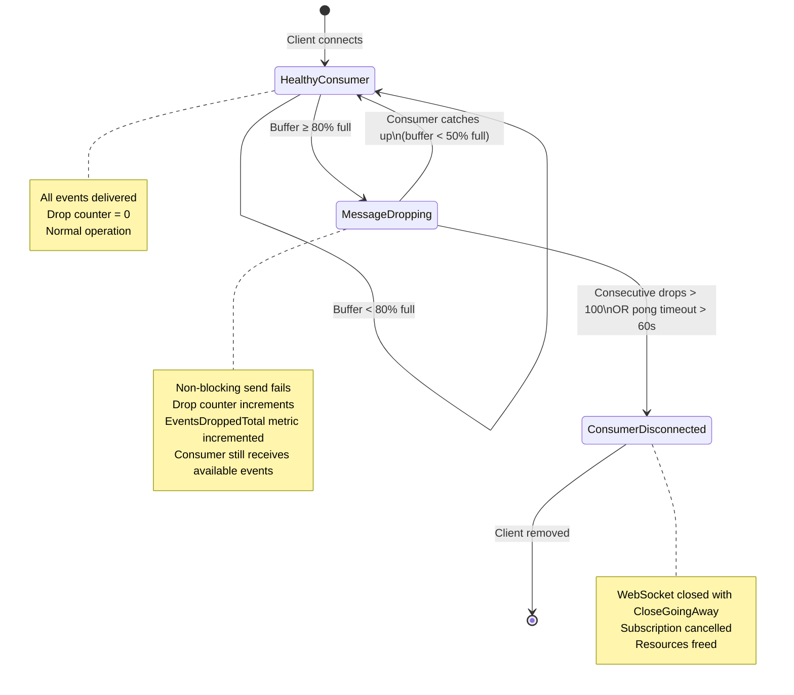

# WebSocket Gateway Design

**Visual Diagrams:**
- [Component Architecture](../diagrams/design/WEBSOCKET_GATEWAY_ARCHITECTURE_DIAGRAM.md)
- [Client Connection Lifecycle](../diagrams/state/CLIENT_CONNECTION_LIFECYCLE_DIAGRAM.md)

## Real-Time Market Data Distribution System

### Version

Week 1 Architecture Design

### Purpose

The WebSocket Gateway is responsible for maintaining persistent client connections and delivering real-time market data updates.

It acts as the external access layer between the Market Data Platform and connected clients.

The gateway must support:

* Persistent connections
* Subscribe requests
* Unsubscribe requests
* Connection lifecycle management
* 5,000 concurrent connections
* Low-latency message delivery

The gateway should remain independent from:

* Redis
* Kafka
* Persistence
* Market data generation

---

# 1. System Position

## High-Level Architecture

```text
Feed Generator
      ↓

Publisher Service
      ↓

Topic Manager
      ↓

WebSocket Gateway
      ↓

Connected Clients
```

The gateway does not generate market data.

The gateway only:

* Accepts client connections
* Manages subscriptions
* Delivers updates

---

# 2. Core Responsibilities

## Connection Management

Maintain long-lived WebSocket connections.

Example:

```text
Client
    ↓
WebSocket Upgrade
    ↓
Persistent Connection
```

Connections remain active until:

* Client disconnects
* Timeout occurs
* Server shutdown
* Network failure

---

## Subscription Management

Allow clients to express interest in topics.

Example:

```text
Subscribe
    ↓
AAPL
```

The gateway forwards subscription requests to the Topic Manager.

---

## Unsubscription Management

Allow clients to stop receiving updates.

Example:

```text
Unsubscribe
    ↓
AAPL
```

The gateway updates subscription state accordingly.

---

## Message Delivery

Receive updates from the Topic Manager and deliver them to interested clients.

Example:

```text
AAPL Update
      ↓
Gateway
      ↓
Subscribed Clients
```

---

# 3. Connection Lifecycle

## Connection Establishment

```text
Client
      ↓

TCP Connection
      ↓

WebSocket Upgrade
      ↓

Connection Registered
      ↓

Ready
```

At this stage:

```text
Client ID Assigned
Connection Created
Resources Allocated
```

---

## Active Phase

Client may:

```text
Subscribe
Unsubscribe
Receive Updates
Send Heartbeats
```

The connection remains healthy.

---

## Disconnect Phase

Disconnect may occur because of:

```text
Client Close

Network Failure

Idle Timeout

Server Shutdown
```

Resources must be cleaned up.

---

## Cleanup Phase

Required actions:

```text
Remove Connection

Remove Subscriptions

Release Resources

Update Metrics
```

Failure to perform cleanup leads to memory leaks.

---

# 4. Client Management

## Client Registry

The gateway should maintain a registry of active clients.

Conceptually:

```text
Client ID
      →
Connection
```

Example:

```text
Client 1
Client 2
Client 3
```

The registry provides:

```text
Lookup

Registration

Removal
```

---

## Client State

Each client should maintain:

```text
Connection Reference

Subscription List

Connection Status

Outbound Queue
```

The gateway tracks state but not business logic.

---

## Why Separate Client Objects?

Benefits:

```text
Isolation

Easier Cleanup

Better Monitoring

Independent Delivery
```

Each client becomes a manageable unit.

---

# 5. Recommended Concurrency Model

## Design Goal

Support:

```text
5000 Concurrent Connections
```

without excessive contention.

---

## Per-Connection Ownership Model

Each connection owns its state.

Conceptually:

```text
Client
      ↓

Read Loop

Write Loop
```

This minimizes synchronization complexity.

---

## Recommended Goroutines

### Read Goroutine

Responsible for:

```text
Incoming Messages

Subscribe Requests

Unsubscribe Requests

Heartbeats
```

Only reads from the socket.

---

### Write Goroutine

Responsible for:

```text
Market Updates

Heartbeat Responses

System Messages
```

Only writes to the socket.

---

## Why Separate Read and Write?

Benefits:

```text
No Concurrent Socket Writes

Clear Ownership

Reduced Race Conditions
```

This is the standard production pattern.

---

# 6. Message Flow

## Subscribe Flow

```text
Client
      ↓

Subscribe(AAPL)
      ↓

Gateway
      ↓

Topic Manager
      ↓

Subscription Added
```

---

## Unsubscribe Flow

```text
Client
      ↓

Unsubscribe(AAPL)
      ↓

Gateway
      ↓

Topic Manager
      ↓

Subscription Removed
```

---

## Market Data Flow

```text
Feed Generator
      ↓

Publisher
      ↓

Topic Manager
      ↓

Gateway
      ↓

Client Queue
      ↓

WebSocket Write
```

The gateway should not participate in topic matching.

Topic Manager handles routing.

---

# 7. Outbound Delivery Model

## Problem

Clients consume data at different speeds.

Example:

```text
Client A
Fast

Client B
Slow
```

Without isolation:

```text
Slow Client
      ↓
Blocks Gateway
```

---

## Recommended Design

Each client owns:

```text
Outbound Queue
```

Architecture:

```text
Market Update
      ↓

Client Queue
      ↓

Write Goroutine
      ↓

WebSocket
```

Benefits:

```text
Isolation

Backpressure Control

Failure Containment
```

---

# 8. Queue Strategy

## Purpose

Absorb bursts.

Example:

```text
1000 Updates
```

arrive in a short period.

Queue smooths delivery.

---

## Bounded Queues

Never allow unlimited growth.

Bad:

```text
Infinite Queue
```

Result:

```text
Memory Explosion
```

---

## Recommended

```text
Fixed Capacity Queue
```

When full:

```text
Drop Messages

Disconnect Client

Apply Policy
```

depending on business requirements.

---

# 9. Failure Handling

## Client Disconnect

Example:

```text
Browser Closed
```

Detection:

```text
Write Failure

Read Failure

Heartbeat Timeout
```

Response:

```text
Cleanup
```

---

## Slow Consumer

Example:

```text
Client Cannot Process Updates
```

Symptoms:

```text
Growing Queue
```

Response:

```text
Warning

Drop Messages

Disconnect
```

depending on policy.

---

## Network Failure

Example:

```text
Wi-Fi Lost
```

Connection becomes unreachable.

Response:

```text
Timeout Detection
Cleanup
```

---

## Gateway Failure

Future deployments should support:

```text
Multiple Gateway Instances
```

allowing clients to reconnect elsewhere.

---

# 10. Heartbeat Strategy

## Purpose

Detect dead connections.

Without heartbeats:

```text
Connection Appears Alive
```

while the client is gone.

---

## Recommended Flow

```text
Server Ping
      ↓

Client Pong
      ↓

Connection Healthy
```

Missing responses indicate failure.

---

# 11. Locking Strategy

## Avoid Global Locks

Bad:

```text
5000 Clients
      ↓

Single Lock
```

Results:

```text
High Contention
```

---

## Recommended

### Client Registry Lock

Protects:

```text
Client Add

Client Remove

Lookup
```

---

### Client-Owned State

Connection state should be owned by the client.

Benefits:

```text
Minimal Shared State

Lower Contention

Higher Throughput
```

---

# 12. Performance Considerations

## Connection Count

Target:

```text
5000 Connections
```

---

## Goroutine Count

Recommended:

```text
2 Goroutines Per Connection
```

Results:

```text
10000 Goroutines
```

This is acceptable in Go.

---

## Memory Usage

Major contributors:

```text
Connection Objects

Outbound Queues

Subscription State
```

Careful queue sizing is critical.

---

## Hot Path

Most frequent operation:

```text
Market Update
      ↓
Client Delivery
```

Optimize for:

```text
Low Allocation

Minimal Locking

Fast Fan-Out
```

---

# 13. Observability

## Connection Metrics

```text
active_connections

connections_opened

connections_closed
```

---

## Subscription Metrics

```text
active_subscriptions

subscriptions_added

subscriptions_removed
```

---

## Delivery Metrics

```text
messages_sent

messages_dropped

delivery_latency
```

---

## Queue Metrics

```text
queue_depth

slow_consumers
```

---

## Error Metrics

```text
socket_errors

heartbeat_failures

disconnects
```

---

# 14. Future Redis Integration

Current:

```text
Topic Manager
      ↓
Gateway
      ↓
Clients
```

Future:

```text
Redis Pub/Sub
      ↓
Gateway Cluster
      ↓
Clients
```

Each gateway instance subscribes to Redis topics.

No gateway redesign required.

---

# 15. Complete Architecture

```text
                  Feed Generator
                         ↓

                  Publisher Service
                         ↓

                   Topic Manager
                         ↓

                WebSocket Gateway
                         ↓

             +-----------+-----------+
             |           |           |
             ↓           ↓           ↓

          Client A    Client B    Client C

             ↓           ↓           ↓

      Read Loop     Read Loop    Read Loop

      Write Loop    Write Loop   Write Loop

             ↓           ↓           ↓

       Outbound     Outbound     Outbound
         Queue        Queue        Queue
```

---

# Recommended Production Design

For a market data platform targeting 5,000 concurrent WebSocket connections:

### Client Management

```text
Client Registry
Per-Client State
```

### Concurrency

```text
Read Goroutine
Write Goroutine
Per Connection
```

### Delivery

```text
Per-Client Queues
Asynchronous Fan-Out
```

### Failure Handling

```text
Heartbeat Detection
Slow Consumer Protection
Automatic Cleanup
```

### Scalability

```text
Gateway Clustering
Redis Integration
Horizontal Scaling
```

### Future Ready

```text
Redis
Kafka
NATS
Replay Service
```

can be added without modifying the WebSocket Gateway's core architecture.

The gateway should remain a lightweight connection-management and delivery layer while all routing and business logic stay in the Topic Manager and Publisher Service.


---

# Sub-component: BACKPRESSURE_DESIGN

---

## Strategy Comparison Table

| Strategy | Latency | Throughput | Memory | User Experience | Market Data Suitability |
|----------|---------|------------|--------|-----------------|------------------------|
| **Blocking** | Unbounded degradation | Collapses under load | Unbounded growth | All clients stall | Unacceptable |
| **Drop Newest** | Low for retained messages | Stable | Bounded | Misses latest price | Poor — stale data is worse than missing data |
| **Drop Oldest** | Constant, predictable | Maintained for all consumers | Bounded, tunable | Minor gaps, auto-recovery | Excellent — latest price always available |
| **Disconnect** | N/A for disconnected client | Maintained for remaining clients | Bounded (client removed) | Hard failure, requires reconnect | Good — surgical removal of problem consumers |

---

## Detailed Reasoning

### 1. Blocking

The publisher or fan-out goroutine blocks on `ch <- event` until the slow consumer drains its buffer.

**Why it fails in this system:**

At 10,000 msgs/sec, a single slow consumer (100 msgs/sec) causes the publisher to block after filling a 256-slot buffer in ~25ms. The publisher goroutine stalls. Every other subscriber on the same topic stops receiving updates. One bad consumer poisons the entire fan-out path.

In a market data context, this means a single trader with a slow network connection freezes price delivery for every other trader on the same symbol. This is operationally unacceptable.

**Verdict:** Never use in a multi-consumer fan-out system.

### 2. Drop Newest

Non-blocking send with a twist: when the buffer is full, discard the incoming event (the "newest" message).

**The problem with market data:**

Market data has no value in historical ticks. A trader wants the latest bid/ask for AAPL, not the one from 30 seconds ago. Dropping the newest message means the consumer retains stale data while the most recent price update — the only one that matters — is discarded.

Additionally, "drop newest" creates a paradox: if the consumer is slow, the buffer is full of old messages. Dropping the newest means the consumer is guaranteed to never see the latest state. The buffer becomes a museum of expired prices.

**Verdict:** Conceptually wrong for market data. Stale data is worse than gaps.

### 3. Drop Oldest

Non-blocking send with `default` fallback that discards the oldest message in the buffer (or simply drops the incoming event if the buffer is modeled as a ring/circular buffer).

**Why this is the industry standard for market data:**

- **Latest price always wins.** When a new tick arrives and the buffer is full, the oldest tick is removed. The consumer always has access to the most recent prices.
- **Bounded memory.** Buffer size is fixed. No goroutine leaks, no unbounded growth.
- **Constant latency.** The publish path never blocks. Fan-out time is O(subscribers), not O(buffer drain).
- **Graceful degradation.** A slow consumer sees gaps in the data stream but always sees the latest price when it catches up. This is the correct behavior for trading systems — a gap is recoverable, stale data is not.
- **No head-of-line blocking.** Other consumers on the same topic are unaffected.

**Current implementation in this codebase:**

The `pubsub/memory.go` and `topicmanager/memory.go` modules implement a variant of this: non-blocking `select`/`default` on the subscriber channel. When the channel (capacity 256) is full, the event is dropped. The `pubsub` layer tracks this via `EventsDroppedTotal` metrics and per-subscriber `dropped` counters.

**Verdict:** Optimal for market data. The correct default strategy.

### 4. Disconnect Slow Consumer

After detecting sustained backpressure (consecutive drops exceeding a threshold), forcibly close the WebSocket connection and unsubscribe the consumer.

**When this is appropriate:**

- The consumer is so slow that it will never catch up (e.g., consuming at 1% of production rate).
- The consumer is consuming resources (goroutine, memory, file descriptor) without benefit.
- The consumer's network is degraded or dead (detected via ping/pong timeout).

**Current implementation in this codebase:**

`internal/websocket/client.go` implements this via `consecutiveDrops` (threshold: 100). The write pump tracks consecutive failed non-blocking sends. After 100 consecutive failures, the client is disconnected. Additionally, ping/pong timeouts (54s/60s) detect dead connections, and write deadlines (10s) detect broken TCP connections.

**Verdict:** Essential as a secondary policy. Complements drop-oldest for permanently degraded consumers.

---

## Recommended Policy

### Primary: Drop Oldest

All subscriber channels use bounded buffers with non-blocking sends. When the buffer is full, the incoming event is dropped. The subscriber retains the most recent N events in its buffer.

### Secondary: Disconnect Extremely Slow Consumers

Consumers that fall below a sustained throughput threshold are disconnected. This prevents resource waste on consumers that will never recover.

### The combination:

```
Healthy Consumer (buffer < 80% full)
        │
        │ Buffer fills due to slow consumption
        ▼
Message Dropping (buffer ≥ 80% full)
        │
        │ Drops continue for > threshold duration
        ▼
Consumer Disconnected (sustained slow consumer)
```

---

## State Diagram



---

## Operational Thresholds

### Queue Size Recommendations

| Layer | Buffer Size | Rationale |
|-------|-------------|-----------|
| Feed output channel | 64 | Absorbs 6ms burst at 10k msgs/sec. Feed is fast; minimal buffering needed. |
| Per-subscriber event channel | 256 | Absorbs ~25ms of consumer stall at 10k msgs/sec. Balances memory (256 × ~200B ≈ 50KB per subscriber) against latency tolerance. |
| Worker pool queue | 4,096 | Absorbs ~400ms burst. Decouples feed generation from fan-out. |
| Client control channel | 64 | Control messages (subscribe/unsubscribe) are infrequent. 64 is generous. |

### Slow Consumer Thresholds

| Metric | Threshold | Action |
|--------|-----------|--------|
| Buffer occupancy | ≥ 80% (205/256 events) | Enter "Message Dropping" state. Log warning. |
| Consecutive drops | 100 | Disconnect consumer. Log error. |
| Drop rate (sustained) | > 50% of events dropped over 10-second window | Enter "Message Dropping" state. Alert. |
| Drop rate (sustained) | > 90% of events dropped over 30-second window | Disconnect consumer. |

### Disconnect Thresholds

| Condition | Timeout | Action |
|-----------|---------|--------|
| Consecutive write failures | 100 | Disconnect (existing `maxConsecutiveDrops`) |
| Pong not received | 60 seconds | Disconnect (existing `pongWait`) |
| Write deadline exceeded | 10 seconds | Disconnect (existing `writeWait`) |
| Connection limit reached | 5,000 | Reject new connections with HTTP 503 |

---

## Monitoring Metrics

### Prometheus Metrics (existing + recommended additions)

| Metric | Type | Labels | Purpose |
|--------|------|--------|---------|
| `rtmds_events_dropped_total` | Counter | `symbol` | Total events dropped per symbol (already exists) |
| `rtmds_subscribers_active` | Gauge | — | Current active subscribers (already exists) |
| `rtmds_ws_connections_active` | Gauge | — | Current WebSocket connections (already exists) |
| **`rtmds_consumer_buffer_occupancy`** | Gauge | `subscriber_id` | Current buffer fill level (0.0–1.0) — **recommended** |
| **`rtmds_consumer_disconnects_total`** | Counter | `reason` | Total disconnections by reason — **recommended** |
| **`rtmds_consumer_lag_seconds`** | Gauge | `subscriber_id` | Estimated time gap between producer and consumer — **recommended** |
| **`rtmds_write_errors_total`** | Counter | `client_id` | Total write errors per client — **recommended** |

### Alert Rules

| Alert | Condition | Severity |
|-------|-----------|----------|
| High drop rate | `rate(rtmds_events_dropped_total[1m]) > 1000` | Warning |
| Consumer disconnect storm | `rate(rtmds_consumer_disconnects_total[5m]) > 10` | Critical |
| Buffer saturation | `rtmds_consumer_buffer_occupancy > 0.9` for > 30s | Warning |
| Connection limit | `rtmds_ws_connections_active > 4500` | Warning |

---

## Failure Scenarios and Mitigations

### Scenario 1: Burst Load (Market Open)

**Trigger:** Market opens, 10,000 events/sec spike across 500 symbols.

**Impact:** All subscriber buffers fill simultaneously. Drop rates spike.

**Mitigation:**
- Per-subscriber buffers (256 events) absorb the initial burst.
- Worker pool queue (4,096) decouples feed from fan-out.
- Drop-oldest ensures no publisher stall.
- Monitor `EventsDroppedTotal` spike; alert if > 50% drop rate sustained.

### Scenario 2: Network Partition (Client Disconnects Mid-Stream)

**Trigger:** Client's network drops without TCP FIN (no clean close).

**Impact:** Server keeps trying to write to a dead socket. Write buffer fills. Goroutine leaks if not handled.

**Mitigation:**
- Ping/pong heartbeat (54s ping, 60s pong timeout) detects dead connections.
- Write deadline (10s) ensures write errors surface quickly.
- `writePump` returns on first write error, cleaning up the goroutine.
- `readPump` sets read deadline; pong handler resets it. No pong = timeout = cleanup.

### Scenario 3: Thundering Herd (Mass Reconnect)

**Trigger:** Server restarts, 5,000 clients reconnect simultaneously.

**Impact:** Connection limit (5,000) is hit immediately. New connections rejected with 503.

**Mitigation:**
- Gateway rejects new connections at capacity (HTTP 503).
- Clients implement exponential backoff on reconnect.
- `maxConnections` prevents resource exhaustion.
- Consider connection admission control: reject connections above 4,500 with a retry-after header.

### Scenario 4: Memory Exhaustion (Subscriber Leak)

**Trigger:** Subscribe/Unsubscribe race causes subscriber entries to accumulate without cleanup.

**Impact:** Memory grows unbounded. Channel buffers (256 events × leak count) consume RAM.

**Mitigation:**
- `subscriber.closed` atomic flag prevents double-cleanup.
- `sync.Once` on unsubscribe ensures single execution.
- `Done` channel pattern avoids send-on-closed-channel race.
- Monitor `SubscribersActive` gauge; alert on unexpected growth.
- Worker pool `QueueCapacity` (4,096) bounds internal queue memory.

### Scenario 5: Fan-Out Starvation (Slow Consumer Blocks Topic)

**Trigger:** One subscriber on AAPL is so slow that the fan-out loop for AAPL takes 50ms instead of 5μs.

**Impact:** Other subscribers on AAPL experience increased latency. Subscribers on other topics are unaffected (sharded architecture).

**Mitigation:**
- Snapshot fan-out: copy subscriber references under lock, release lock, then fan-out outside the critical section.
- Per-topic locking (or sharded locking) prevents cross-topic contention.
- Non-blocking sends ensure the slowest subscriber does not delay the fastest.
- Drop-oldest on individual subscriber channels isolates the slow consumer.

### Scenario 6: Control Channel Overflow

**Trigger:** Rapid subscribe/unsubscribe churn fills the client's control channel (capacity 64).

**Impact:** Control messages (subscribe confirmations, error messages) are dropped.

**Mitigation:**
- Control channel non-blocking send with warning log (existing `sendControl`).
- Control messages are informational; dropping them does not corrupt state.
- The subscription state is managed by the TopicManager, not the control channel.
- Monitor for "control channel full" warnings — if frequent, the client may be misbehaving.

---

## Summary

The system's existing backpressure architecture — **non-blocking send, drop-on-full, disconnect-on-sustained-slow** — is the correct approach for a market data distribution system. The key principles:

1. **Never block the publisher.** One slow consumer must never stall delivery to others.
2. **Drop oldest, not newest.** The latest price is always more valuable than a historical one.
3. **Bound everything.** Every buffer, queue, and channel has a fixed capacity.
4. **Disconnect surgically.** Remove permanently degraded consumers after a grace period.
5. **Monitor everything.** Drop rates, buffer occupancy, and disconnect counts are operational signals, not errors.

This is the same strategy used by Bloomberg Terminal, Refinitiv Elektron, and most institutional market data platforms.


---

# Sub-component: RATE_LIMITING_DESIGN
Target environment:

```text id="qk8gxw"
5000+ Concurrent Clients

10000+ Market Updates/sec

Heavy Read Workload
```

Rate limiting applies to:

```text id="4v8bbh"
Subscribe Requests

Unsubscribe Requests

Control Messages

Connection Establishment
```

Market data delivery itself should generally not be rate limited.

---

# 1. Why Rate Limiting Exists

Without protection:

```text id="7d08rf"
Client
      ↓

Subscribe(AAPL)

Subscribe(MSFT)

Subscribe(GOOG)

Subscribe(...)
```

can generate thousands of requests per second.

Consequences:

```text id="8uytfz"
CPU Exhaustion

Lock Contention

Registry Growth

Memory Pressure
```

A single abusive client can degrade service for all users.

---

# 2. Threat Model

## Scenario 1

Subscription Spam

```text id="o2apv4"
10000 Subscribe Requests/sec
```

against the Topic Manager.

Impact:

```text id="ab83cc"
Registry Contention

Increased Latency
```

---

## Scenario 2

Connection Churn

```text id="v2pk8v"
Connect
Disconnect
Reconnect
```

thousands of times per second.

Impact:

```text id="plz5wp"
Connection Management Overhead
```

---

## Scenario 3

Malformed Clients

Example:

```text id="h15mzs"
Infinite Retry Loop
```

from buggy software.

Impact:

```text id="4pnijv"
Resource Waste
```

---

## Scenario 4

Intentional Abuse

Example:

```text id="7f4jzo"
Bot Network
```

attempting to overwhelm the gateway.

Impact:

```text id="4jcv2m"
Denial Of Service
```

---

# 3. Rate Limiting Scope

## Recommended Limits

### Connection Creation

```text id="if34yh"
Connections Per Minute
```

---

### Subscribe Requests

```text id="jox1d8"
Subscribe Requests Per Second
```

---

### Unsubscribe Requests

```text id="slg7v2"
Unsubscribe Requests Per Second
```

---

### Control Messages

```text id="c9wgln"
Administrative Messages
```

---

## Not Recommended

Do not rate limit:

```text id="kz6q9z"
Market Data Delivery
```

The platform exists to distribute market data.

Limiting delivery defeats its purpose.

---

# 4. Fixed Window Algorithm

## Concept

Time divided into fixed intervals.

Example:

```text id="e4eovc"
Window
=
1 Second
```

Limit:

```text id="skp6zi"
100 Requests
```

per window.

---

## Example

```text id="3wntkq"
12:00:00
100 Requests
```

Allowed.

```text id="4nj61h"
12:00:01
Counter Resets
```

Client receives another:

```text id="1t1p6f"
100 Requests
```

immediately.

---

# Advantages

Simple.

```text id="5g06xl"
Low Memory

Low CPU

Easy To Implement
```

---

# Disadvantages

Boundary problem.

Example:

```text id="1knc6x"
100 Requests
At End Of Window

100 Requests
At Beginning Of Next Window
```

Effective burst:

```text id="4a49qa"
200 Requests
```

despite limit of:

```text id="htz3zt"
100
```

Produces uneven traffic.

---

# 5. Leaky Bucket Algorithm

## Concept

Requests enter a bucket.

Bucket drains at a fixed rate.

Architecture:

```text id="dcjlwm"
Incoming Requests
        ↓

     Bucket
        ↓

 Fixed Output Rate
```

---

## Behavior

Traffic becomes smooth.

Example:

```text id="g2wuws"
Burst
100 Requests
```

is transformed into:

```text id="8a1ddx"
10/sec

10/sec

10/sec
```

---

# Advantages

Excellent traffic smoothing.

Predictable load.

Stable downstream systems.

---

# Disadvantages

Punishes legitimate bursts.

Example:

```text id="u77vgm"
Client Reconnects

Subscribes To
50 Symbols
```

Leaky bucket may delay valid requests.

Not ideal for market data clients.

---

# 6. Token Bucket Algorithm

## Concept

Tokens accumulate over time.

Example:

```text id="pn83fu"
Rate
=
10 Tokens/sec
```

Maximum capacity:

```text id="0k8vhv"
100 Tokens
```

---

## Operation

Each request consumes a token.

Example:

```text id="s6jc18"
Subscribe Request
      ↓
Consume Token
```

If tokens exist:

```text id="wvv7wv"
Allowed
```

Otherwise:

```text id="vjib9m"
Rejected
```

---

## Burst Support

Client idle for some time:

```text id="g1q0rz"
Tokens Accumulate
```

Example:

```text id="o7t8gc"
100 Available Tokens
```

Client reconnects:

```text id="rzt15r"
50 Subscribe Requests
```

Processed immediately.

This is desirable.

---

# Advantages

Supports bursts.

Fair.

Predictable.

Widely used in production systems.

---

# Disadvantages

Slightly more complex.

Requires token accounting.

Still very manageable.

---

# 7. Algorithm Comparison

| Property                | Fixed Window | Leaky Bucket | Token Bucket |
| ----------------------- | ------------ | ------------ | ------------ |
| Simplicity              | Excellent    | Good         | Good         |
| Burst Handling          | Poor         | Poor         | Excellent    |
| Fairness                | Moderate     | Good         | Excellent    |
| Resource Protection     | Moderate     | Excellent    | Excellent    |
| Market Data Suitability | Moderate     | Moderate     | Excellent    |
| Production Adoption     | High         | High         | Very High    |

---

# 8. Market Data Specific Considerations

Real trading clients behave differently from REST APIs.

Example:

```text id="0x6j9d"
Client Connects
```

Immediately:

```text id="q2v90j"
Subscribe AAPL

Subscribe MSFT

Subscribe GOOG

Subscribe TSLA

Subscribe NVDA
```

A short burst is normal.

---

## Fixed Window Problem

May allow:

```text id="e4h4kh"
Huge Window Boundary Bursts
```

creating load spikes.

---

## Leaky Bucket Problem

May artificially delay:

```text id="i4w3yl"
Legitimate Startup Activity
```

creating unnecessary latency.

---

## Token Bucket Benefit

Supports:

```text id="6aj8nt"
Short Bursts
```

while preventing:

```text id="d9xnwx"
Sustained Abuse
```

This matches market data behavior well.

---

# 9. Multi-Layer Rate Limiting

Recommended architecture:

```text id="sd6g4v"
Connection Limit
        ↓

Client Rate Limit
        ↓

Subscription Limit
        ↓

Topic Manager
```

---

## Layer 1

Connection Protection

Example:

```text id="pm0x2j"
10 New Connections/sec
```

per client identity.

Protects gateway resources.

---

## Layer 2

Subscription Requests

Example:

```text id="qxb5jy"
50 Subscribe Requests/sec
```

per connection.

Protects Topic Manager.

---

## Layer 3

Maximum Active Subscriptions

Example:

```text id="tzf5s4"
1000 Symbols
```

per client.

Protects memory usage.

---

# 10. Failure Handling

When limits are exceeded:

```text id="xsk2e8"
Warning
      ↓
Throttle
      ↓
Disconnect
```

depending on severity.

---

## Recommended Policy

Occasional violation:

```text id="8cbog5"
Reject Request
```

Repeated violation:

```text id="m3bwj7"
Temporary Ban
```

Persistent abuse:

```text id="0zpdjt"
Disconnect
```

---

# 11. Observability

Track:

```text id="hm52k5"
rate_limit_hits

requests_rejected

active_tokens

subscription_requests
```

---

## Abuse Metrics

```text id="mof1wr"
top_clients

violations

disconnects
```

These become extremely useful during incidents.

---

# 12. Recommended Production Design

For a WebSocket market data gateway:

### Algorithm

```text id="qzshpb"
Token Bucket
```

---

### Limits

```text id="jbk15u"
Connection Creation

Subscribe Requests

Unsubscribe Requests
```

---

### Additional Protection

```text id="8e31ee"
Maximum Active Subscriptions
```

per client.

---

### Enforcement

```text id="3j31ni"
Reject
Throttle
Disconnect
```

depending on severity.

---

# Final Recommendation

For a market data platform serving:

```text id="gvvt6u"
5000+ Concurrent Clients
```

the best choice is:

```text id="wt3ts5"
Token Bucket
```

because it provides:

```text id="k9yr9l"
Burst Tolerance

Fairness

Abuse Prevention

Low Overhead

Excellent User Experience
```

while matching the real behavior of trading applications that frequently perform short bursts of subscription activity during connection establishment and recovery.

If this were a quantitative trading system, I would implement:

```text id="ps0qdl"
Per-Client Token Bucket
+
Connection Rate Limits
+
Subscription Caps
+
Observability Metrics
```

which provides the best balance of operational safety, scalability, and client experience.


---

# Sub-component: PER_SUBSCRIBER_BUFFERING_DESIGN

```text
5000 Concurrent Clients
10000+ Market Updates/sec
```

The buffering layer sits between:

```text
Feed Generator
      ↓
Publisher
      ↓
Topic Manager
      ↓
WebSocket Gateway
      ↓
Client Queues
      ↓
Client Connections
```

---

# 1. Problem Statement

Not all clients consume data at the same speed.

Example:

```text
Client A
1 Gbps Connection

Client B
Mobile Network

Client C
Browser Tab In Background
```

Market updates continue arriving regardless of client performance.

Without buffering:

```text
Market Update
      ↓
Write Socket
```

every publish operation becomes dependent on network speed.

This creates a major scalability problem.

---

# 2. Why Per-Subscriber Buffers Exist

Without isolation:

```text
Market Update
      ↓

Client A

Client B

Client C
```

A single slow client can delay the entire fan-out pipeline.

Result:

```text
Increased Latency

Blocked Publishers

Reduced Throughput
```

---

## Desired Architecture

Each client owns an independent queue.

```text
                 Topic Manager
                        ↓

      +---------------+---------------+
      |               |               |
      ↓               ↓               ↓

 Client A Queue  Client B Queue  Client C Queue
      ↓               ↓               ↓

 WebSocket A     WebSocket B     WebSocket C
```

Benefits:

```text
Isolation

Failure Containment

Independent Backpressure
```

---

# 3. Core Design Principle

A client connection should never be allowed to directly influence:

```text
Publisher

Topic Manager

Other Clients
```

The only component affected by a slow client should be:

```text
That Client
```

---

# 4. Queue Ownership Model

Each client owns:

```text
Client State

Outbound Queue

Write Worker

Connection Metadata
```

Example:

```text
Client 123

Queue:
[Msg1]
[Msg2]
[Msg3]
```

The queue acts as a temporary buffer between:

```text
Production Rate
```

and

```text
Consumption Rate
```

---

# 5. Message Flow

## Normal Flow

```text
Market Update
      ↓

Topic Manager
      ↓

Client Queue
      ↓

Write Loop
      ↓

WebSocket
      ↓

Client
```

The publisher completes once the update is enqueued.

Actual network transmission happens later.

---

# 6. Burst Handling

## Scenario

Normal traffic:

```text
1000 Updates/sec
```

Burst:

```text
20000 Updates/sec
```

for a short period.

Without buffering:

```text
Immediate Congestion
```

occurs.

---

## With Buffering

```text
Burst
      ↓

Queue Absorbs Spike
      ↓

Client Continues Receiving
```

Benefits:

```text
Smoother Delivery

Reduced Latency Spikes

Fewer Disconnects
```

---

# 7. Queue Sizing Strategy

Queue size is one of the most important architectural decisions.

---

## Small Queues

Example:

```text
Queue Capacity = 50
```

Benefits:

```text
Low Memory Usage

Fast Failure Detection
```

Drawbacks:

```text
Poor Burst Tolerance
```

A short spike may trigger drops.

---

## Large Queues

Example:

```text
Queue Capacity = 10000
```

Benefits:

```text
Excellent Burst Absorption
```

Drawbacks:

```text
Higher Memory Usage

Higher Latency
```

Messages may sit in the queue for a long time.

---

# 8. Queue Depth vs Latency

Large queues hide problems.

Example:

```text
Queue Depth
5000 Messages
```

Client appears connected.

However:

```text
Data Is Seconds Behind
```

which is unacceptable for market data.

---

## Market Data Principle

Fresh data is more valuable than old data.

Therefore:

```text
Smaller Queues
```

are often preferred.

---

# 9. Memory Tradeoffs

Assume:

```text
5000 Clients
```

Queue size:

```text
100 Messages
```

Memory requirement:

```text
5000 × 100
=
500,000 Buffered Messages
```

---

## Increasing Capacity

Queue size:

```text
1000 Messages
```

Results:

```text
5,000,000 Buffered Messages
```

Potentially:

```text
Hundreds Of MBs

Or Several GBs
```

depending on payload size.

---

## Key Observation

Memory usage scales as:

```text
Clients
×
Queue Size
×
Message Size
```

This becomes a major operational concern.

---

# 10. Slow Consumer Problem

Example:

```text
Producer
10000 msg/sec

Client
100 msg/sec
```

Queue fills continuously.

Eventually:

```text
Queue Full
```

The system must react.

---

# 11. Slow Consumer Protection

A production market data system must protect itself.

---

## Option 1: Block Producer

```text
Queue Full
      ↓
Producer Waits
```

Advantages:

```text
No Data Loss
```

Problems:

```text
One Client
Can Affect Entire System
```

Not recommended.

---

## Option 2: Drop Messages

```text
Queue Full
      ↓
Drop New Messages
```

Advantages:

```text
Stable System
```

Problems:

```text
Data Loss
```

Must be monitored carefully.

---

## Option 3: Disconnect Client

```text
Queue Full
      ↓
Client Removed
```

Advantages:

```text
Protects Platform
```

Very common in market data systems.

---

# 12. Market Data Specific Strategy

Most exchanges and trading systems prioritize:

```text
Current Data
```

over

```text
Historical Data
```

for live feeds.

Therefore:

```text
Slow Client
      ↓
Disconnect
```

is often preferable to:

```text
Infinite Buffering
```

---

# 13. Backpressure Interaction

Backpressure should exist at multiple layers.

---

## Layer 1

Client Queue

```text
Queue Filling
```

indicates client problems.

---

## Layer 2

Gateway

```text
Many Full Queues
```

indicates delivery problems.

---

## Layer 3

Topic Manager

```text
Delivery Workers Saturated
```

indicates platform pressure.

---

## Layer 4

Publisher

```text
Task Queue Growing
```

indicates upstream overload.

---

# 14. Recommended Backpressure Model

```text
Feed Generator
      ↓

Publisher Queue
      ↓

Topic Manager
      ↓

Client Queue
      ↓

WebSocket
```

Each layer should expose:

```text
Queue Depth

Utilization

Drop Rate
```

allowing bottlenecks to be identified.

---

# 15. Queue Monitoring

Critical metrics:

```text
queue_depth

queue_capacity

messages_enqueued

messages_sent

messages_dropped
```

---

## Slow Consumer Metrics

```text
slow_clients

queue_full_events

forced_disconnects
```

These metrics often identify problems before users complain.

---

# 16. Failure Scenarios

## Network Degradation

```text
Client Network Slows
```

Result:

```text
Queue Growth
```

System response:

```text
Detect

Warn

Disconnect
```

---

## Burst Event

Example:

```text
Fed Announcement

Market Open

Earnings Release
```

Traffic spikes dramatically.

Queues absorb short-term load.

---

## Stalled Client

Client stops reading.

Queue fills.

Connection removed automatically.

---

# 17. Recommended Production Design

For:

```text
5000 Concurrent Clients
```

Use:

### Client Isolation

```text
One Queue Per Client
```

---

### Queue Type

```text
Bounded Queue
```

Never unbounded.

---

### Queue Capacity

```text
100–500 Messages
```

Initial production range.

Tune based on benchmarks.

---

### Slow Consumer Policy

```text
Detect

Warn

Disconnect
```

rather than blocking publishers.

---

### Backpressure

```text
Queue Metrics

Drop Metrics

Disconnect Metrics
```

at every layer.

---

# Architecture Summary

```text
                      Market Update
                             ↓

                      Topic Manager
                             ↓

      +----------------------+----------------------+
      |                      |                      |
      ↓                      ↓                      ↓

 Client A Queue       Client B Queue       Client C Queue
      ↓                      ↓                      ↓

 Write Worker         Write Worker         Write Worker
      ↓                      ↓                      ↓

 WebSocket A          WebSocket B          WebSocket C
```

---

# Final Recommendation

For a market data platform targeting:

```text
5000 Clients
10000+ Updates/sec
```

the optimal design is:

```text
Per-Subscriber Bounded Queues
+
Independent Write Loops
+
Queue-Based Backpressure
+
Slow Consumer Disconnection
```

This architecture provides:

```text
Client Isolation

Predictable Memory

Burst Absorption

Operational Stability

Horizontal Scalability
```

while ensuring that no individual client can degrade the performance of the broader market data platform.


---

# Sub-component: STICKY_SESSION_DESIGN
* Load balancer
* Persistent WebSocket connections
* Horizontal scalability
* High availability

Target architecture:

```text
                     Load Balancer
                            │
                            ▼

      +------------+------------+------------+
      |            |            |            |
      ▼            ▼            ▼            ▼

  Gateway 1   Gateway 2   Gateway 3   Gateway N
      │            │            │            │
      ▼            ▼            ▼            ▼

 WebSocket    WebSocket    WebSocket    WebSocket
   Clients      Clients      Clients      Clients

      │            │            │
      └────────────┴────────────┘
                    │
                    ▼

              Redis Pub/Sub
```

---

# 1. What Is A Sticky Session?

A sticky session ensures that a client is routed to the same backend server across requests.

Example:

```text
Client A
      ↓
Gateway 3
```

Future requests:

```text
Client A
      ↓
Gateway 3
```

continue reaching the same gateway.

---

## Without Sticky Sessions

```text
Request 1
Client A
      ↓
Gateway 1

Request 2
Client A
      ↓
Gateway 4

Request 3
Client A
      ↓
Gateway 2
```

Client affinity does not exist.

---

## With Sticky Sessions

```text
Client A
      ↓
Gateway 3

Client A
      ↓
Gateway 3

Client A
      ↓
Gateway 3
```

Client remains attached to one gateway.

---

# 2. Why Sticky Sessions Exist

Sticky sessions were originally introduced for stateful applications.

Example:

```text
User Login State

Shopping Cart

Session Cache
```

stored locally on a server.

---

Without stickiness:

```text
Request
      ↓
Different Server
```

which cannot find local state.

Result:

```text
Lost Session

Authentication Errors

Missing Context
```

---

# 3. WebSocket Specific Behavior

WebSockets are fundamentally different from HTTP.

HTTP:

```text
Request
Response
Disconnect
```

Every request is routed independently.

---

WebSocket:

```text
Connect
      ↓

Persistent TCP Connection
      ↓

Hours Of Communication
```

Once established:

```text
Client
      ↓
Gateway
```

remains fixed.

---

# Important Observation

A WebSocket connection is naturally sticky.

Example:

```text
Client
      ↓
Gateway 2
```

The load balancer only participates:

```text
During Connection Establishment
```

After that:

```text
Traffic Flows Directly
```

between client and gateway.

---

# 4. Why Sticky Sessions May Still Matter

Although active WebSocket connections are already sticky, reconnect behavior introduces challenges.

Example:

```text
Gateway Restart
```

causes:

```text
Client Disconnect
```

Then:

```text
Reconnect
```

occurs.

Without stickiness:

```text
Old Gateway → Gateway 2

Reconnect → Gateway 5
```

Client lands on a different gateway.

---

Potential consequences:

```text
Subscription Rebuild

Cache Misses

Warm-Up Delays
```

---

# 5. Current Gateway Architecture

Assume:

```text
Load Balancer
      ↓

Gateway Pool
      ↓

Redis Pub/Sub
```

Each gateway maintains:

```text
Connection State

Subscription State

Client Buffers
```

locally.

---

# Why Gateway State Matters

Example:

```text
Gateway 2
```

stores:

```text
Client A

Subscribed:
AAPL
MSFT
NVDA
```

If reconnect reaches:

```text
Gateway 5
```

that information is gone.

Client must rebuild state.

---

# 6. Sticky Session Strategies

Several approaches exist.

---

# Strategy 1: Source IP Affinity

Routing:

```text
Hash(IP Address)
      ↓
Gateway
```

Example:

```text
192.168.x.x
      ↓
Gateway 2
```

---

## Advantages

Simple.

Supported by most load balancers.

---

## Disadvantages

Not reliable.

Example:

```text
Corporate NAT

Mobile Networks

Carrier NAT
```

Many users share IPs.

Creates uneven load.

---

# Strategy 2: Cookie-Based Affinity

Load balancer issues:

```text
Session Cookie
```

Example:

```text
gateway=3
```

Future requests:

```text
Cookie
      ↓
Gateway 3
```

---

## Advantages

Accurate routing.

Widely supported.

---

## Disadvantages

Additional session management.

More useful for HTTP than WebSockets.

---

# Strategy 3: Consistent Hashing

Route using:

```text
Client ID
```

or:

```text
Account ID
```

Architecture:

```text
Client ID
      ↓

Hash Function
      ↓

Gateway Selection
```

---

Example:

```text
Client 12345
      ↓
Gateway 4
```

Always.

---

## Advantages

Predictable placement.

Good distribution.

No cookies required.

---

## Disadvantages

Gateway additions require rebalancing.

---

# Strategy 4: Stateless Gateways

Preferred modern design.

Gateway stores only:

```text
Live Connections
```

while subscription state is externalized.

Example:

```text
Redis

Database

Distributed Registry
```

---

Result:

```text
Reconnect
      ↓
Any Gateway
```

works.

No affinity required.

---

# 7. Alternative: Fully Stateless Architecture

Architecture:

```text
Client
      ↓

Load Balancer
      ↓

Any Gateway
      ↓

Redis Pub/Sub
      ↓

Distributed State
```

Gateway crash:

```text
Reconnect
      ↓
Different Gateway
```

No operational issue.

---

Benefits:

```text
Easy Scaling

Easy Failover

No Sticky Sessions Needed
```

---

# 8. Load Balancer Behavior

For WebSockets:

```text
HTTP Upgrade
      ↓
WebSocket
```

Load balancer chooses a gateway once.

After upgrade:

```text
Connection Pinned
```

to that gateway.

---

Therefore:

```text
Sticky Sessions
```

mainly affect:

```text
Reconnect Behavior
```

not active traffic.

---

# 9. Failure Scenario: Gateway Crash

Example:

```text
Gateway 3
```

fails.

---

Clients:

```text
Disconnected
```

---

Reconnect:

```text
Load Balancer
      ↓
Gateway 7
```

---

### With Sticky Sessions

May attempt:

```text
Gateway 3
```

which no longer exists.

Extra failover logic required.

---

### Without Sticky Sessions

Reconnect immediately lands on:

```text
Healthy Gateway
```

Often preferable.

---

# 10. Failure Scenario: Gateway Scaling Event

Example:

```text
5 Gateways
      ↓
10 Gateways
```

---

With affinity:

```text
Existing Clients
Remain On Old Nodes
```

Load imbalance occurs.

---

Without affinity:

```text
Natural Rebalancing
```

happens as clients reconnect.

---

# 11. Tradeoffs

| Approach               | Benefits            | Drawbacks               |
| ---------------------- | ------------------- | ----------------------- |
| Source IP Affinity     | Simple              | Poor distribution       |
| Cookie Affinity        | Accurate            | Session management      |
| Consistent Hashing     | Predictable routing | Rebalancing complexity  |
| Stateless Gateways     | Simplest operations | Requires external state |
| Strong Sticky Sessions | Faster reconnects   | Operational complexity  |

---

# 12. Market Data Platform Considerations

Market data systems prioritize:

```text
Availability

Scalability

Low Latency

Fault Tolerance
```

More than:

```text
User Session Continuity
```

Unlike e-commerce applications.

---

Client subscriptions can usually be:

```text
Re-Sent

Rebuilt

Recovered
```

after reconnect.

---

Therefore:

```text
Gateway Affinity
```

is often less valuable than:

```text
Fast Recovery
```

and:

```text
Operational Simplicity
```

---

# Recommended Architecture

```text
                     Load Balancer
                            │
                            ▼

      +------------+------------+------------+
      |            |            |            |
      ▼            ▼            ▼            ▼

  Gateway 1   Gateway 2   Gateway 3   Gateway N

      │            │            │
      └────────────┴────────────┘
                    │
                    ▼

              Redis Pub/Sub

                    │
                    ▼

          Distributed State Layer
```

Characteristics:

```text
Stateless Gateways

No Hard Affinity

Reconnect To Any Gateway

Externalized State

Horizontal Scalability
```

---

# Final Recommendation

For a WebSocket-based market data platform targeting:

```text
50,000+ Concurrent Connections
```

I would avoid strict sticky sessions.

Recommended approach:

```text
Stateless Gateways
+
Redis Pub/Sub
+
Least Connections Load Balancing
+
External Subscription State
```

Reasons:

```text
Simpler Operations

Better Fault Tolerance

Easier Scaling

Faster Recovery

More Even Load Distribution
```

Sticky sessions are useful when application state exists only on a gateway.

In a modern market data platform, the better architectural goal is:

```text
Remove The Need For Sticky Sessions
```

rather than making sticky sessions a critical dependency.


---

# Sub-component: AUTOMATIC_RECONNECT_DESIGN

Automatic Reconnection

Subscription Restoration

Exponential Backoff

Gap Recovery
```

Target architecture:

```text
                 Feed Generator
                        ↓

                    Publisher
                        ↓

                 Redis Pub/Sub
                        ↓

                Gateway Cluster
                        ↓

               WebSocket Clients
```

---

# 1. Why Automatic Reconnect Is Required

In distributed systems, connection loss is normal.

Common causes:

```text
Gateway Restart

Gateway Crash

Redis Failure

Network Loss

WiFi Change

Mobile Network Handoff

Load Balancer Restart
```

Clients must assume:

```text
Connections Will Eventually Fail
```

The system should recover automatically.

---

# 2. Recovery Objectives

Reconnect logic should provide:

```text
Automatic Recovery

No Manual User Action

Subscription Restoration

Minimal Data Loss

Controlled Retry Behavior
```

---

# 3. Core Design Principle

Treat WebSocket connections as:

```text
Temporary

Disposable

Replaceable
```

Never assume:

```text
A Connection Lives Forever
```

---

# 4. High-Level Reconnect Flow

```text
Connection Lost
        ↓

Detect Disconnect
        ↓

Start Backoff Timer
        ↓

Reconnect
        ↓

Authenticate
        ↓

Recover State
        ↓

Resubscribe
        ↓

Resume Streaming
```

---

# 5. Connection State Machine

Recommended client states:

```text
Connected

Disconnected

Reconnecting

Recovering

Ready
```

---

State transitions:

```text
Connected
      ↓

Disconnected
      ↓

Reconnecting
      ↓

Recovering
      ↓

Ready
```

---

# 6. Disconnect Detection

Disconnect can be detected through:

```text
Socket Closed

Heartbeat Timeout

Read Failure

Write Failure
```

---

Example:

```text
Gateway Crash
```

↓

```text
TCP Connection Closed
```

↓

```text
Reconnect Begins
```

---

# 7. Immediate Reconnect Is Dangerous

Bad approach:

```text
Disconnect
      ↓

Reconnect Immediately
```

Repeated endlessly.

Problems:

```text
CPU Waste

Network Flooding

Reconnect Storms
```

Especially during outages.

---

# 8. Exponential Backoff

Recommended strategy:

```text
Attempt 1
1 Second

Attempt 2
2 Seconds

Attempt 3
4 Seconds

Attempt 4
8 Seconds

Attempt 5
16 Seconds
```

Until maximum delay reached.

---

Benefits:

```text
Reduces Server Pressure

Reduces Network Traffic

Prevents Retry Storms
```

---

# 9. Backoff With Jitter

Pure exponential backoff creates:

```text
Thundering Herd
```

Problem:

```text
10,000 Clients

Reconnect At Same Time
```

---

Solution:

```text
Random Jitter
```

Example:

```text
8 Seconds

→

6-10 Seconds Randomized
```

---

Benefits:

```text
Reconnect Requests Spread Out
```

naturally.

---

# 10. Recommended Backoff Policy

Suggested values:

```text
Initial Delay:
1 Second

Multiplier:
2x

Maximum Delay:
30 Seconds

Jitter:
±20%
```

---

Example sequence:

```text
1s

2s

4s

8s

16s

30s

30s

30s
```

---

# 11. Successful Reconnect Flow

Once connection succeeds:

```text
TCP Connected
```

↓

```text
WebSocket Upgraded
```

↓

```text
Authentication
```

↓

```text
State Recovery
```

↓

```text
Live Streaming
```

---

# 12. Subscription Restoration

Client must maintain:

```text
Local Subscription Registry
```

Example:

```text
AAPL

MSFT

NVDA

TSLA
```

---

After reconnect:

```text
Re-Send Subscriptions
```

---

Flow:

```text
Reconnect
      ↓

Subscribe AAPL

Subscribe MSFT

Subscribe NVDA
```

---

Gateway rebuilds state.

---

# 13. Why Client-Side Subscription Ownership?

Alternative:

```text
Gateway Stores Subscriptions
```

Problems:

```text
State Synchronization

Persistence Complexity

Stale State
```

---

Preferred:

```text
Client Owns Subscription State
```

---

Benefits:

```text
Stateless Gateways

Simple Recovery

Horizontal Scalability
```

---

# 14. Gap Recovery Problem

Example:

```text
Disconnected:
10:00:00

Reconnected:
10:00:15
```

---

Client missed:

```text
15 Seconds Of Updates
```

---

Simple reconnect alone is insufficient.

---

# 15. Sequence Number Tracking

Every market update should contain:

```text
Sequence Number
```

Example:

```text
1001

1002

1003

1004
```

---

Client stores:

```text
Last Received Sequence
```

---

Example:

```text
Last Received:
1004
```

---

# 16. Recovery Using Replay

Reconnect flow:

```text
Reconnect
      ↓

Send Last Sequence
      ↓

Replay Missing Events
      ↓

Receive Snapshot
      ↓

Resume Live Stream
```

---

Example:

```text
Current:
1050

Client:
1004
```

---

Replay:

```text
1005 → 1050
```

---

Client catches up completely.

---

# 17. Snapshot Integration

Alternative recovery:

```text
Reconnect
      ↓

Request Snapshot
      ↓

Apply Snapshot
      ↓

Resume Streaming
```

---

Advantages:

```text
Simple

Fast
```

---

Disadvantages:

```text
Intermediate Events Lost
```

---

# 18. Recommended Recovery Model

Best practice:

```text
Replay Missing Events
      ↓

Apply Snapshot
      ↓

Resume Streaming
```

Provides:

```text
Accurate State

Minimal Data Loss
```

---

# 19. Gateway Restart Scenario

Before:

```text
Gateway 2

5000 Clients
```

---

Failure:

```text
Gateway 2 Crash
```

---

Recovery:

```text
Clients Detect Disconnect
```

↓

```text
Backoff
```

↓

```text
Reconnect Through Load Balancer
```

↓

```text
Gateway 1

Gateway 3

Gateway 4
```

---

Subscriptions restored automatically.

---

# 20. Redis Failure Scenario

Redis unavailable:

```text
Gateways Connected

No Market Updates
```

---

Clients remain connected.

---

Reconnect should NOT occur.

Reason:

```text
Socket Still Healthy
```

---

Only actual connection failures trigger reconnect.

---

# 21. Reconnect Storm Scenario

Example:

```text
20,000 Clients
```

disconnect simultaneously.

---

Without backoff:

```text
20,000 Immediate Reconnects
```

---

Potential effects:

```text
Gateway Overload

Load Balancer Saturation

CPU Spikes
```

---

With exponential backoff + jitter:

```text
Reconnects Spread Over Time
```

---

System remains stable.

---

# 22. Authentication Recovery

If authentication exists:

Reconnect sequence:

```text
Connect
      ↓

Authenticate
      ↓

Validate Session
      ↓

Recover State
```

---

Do not:

```text
Restore Subscriptions
```

before authentication succeeds.

---

# 23. Failure Edge Cases

## Permanent Network Failure

Example:

```text
No Internet
```

Expected:

```text
Continue Backoff

Max Delay Reached

Keep Retrying
```

---

## Invalid Credentials

Expected:

```text
Reconnect Succeeds

Authentication Fails
```

↓

```text
Stop Retry Loop
```

---

Reason:

```text
Not Recoverable Automatically
```

---

## Gateway Overload

Expected:

```text
Connection Rejected
```

↓

```text
Continue Backoff
```

↓

```text
Retry Later
```

---

# 24. Metrics To Monitor

Track:

```text
websocket_reconnect_attempts_total

websocket_reconnect_success_total

websocket_reconnect_failures_total

websocket_resubscriptions_total

websocket_recovery_duration_ms
```

---

Useful alerts:

```text
Reconnect Spike

Authentication Failures

Recovery Latency Increase
```

---

# 25. Recommended Recovery Architecture

```text
          Connection Loss
                   │
                   ▼

        Exponential Backoff
                   │
                   ▼

            Reconnect
                   │
                   ▼

          Authenticate
                   │
                   ▼

         Replay Missing Data
                   │
                   ▼

         Restore Snapshot
                   │
                   ▼

         Re-Subscribe Topics
                   │
                   ▼

           Resume Stream
```

---

# Operational Tradeoffs

## Aggressive Reconnect

```text
1s Fixed Retry
```

Advantages:

```text
Fast Recovery
```

Disadvantages:

```text
Reconnect Storm Risk
```

---

## Large Backoff

```text
60s Retry
```

Advantages:

```text
Minimal Load
```

Disadvantages:

```text
Slow Recovery
```

---

## Recommended

```text
Exponential Backoff

Maximum 30 Seconds

Random Jitter
```

Provides:

```text
Fast Recovery

Controlled Load

Production Stability
```

---

# Final Recommendation

Implement automatic reconnect using:

```text
Exponential Backoff
+
Random Jitter
+
Client-Owned Subscription State
```

Recovery sequence:

```text
Disconnect
      ↓

Backoff
      ↓

Reconnect
      ↓

Authenticate
      ↓

Replay Missing Events
      ↓

Load Snapshot
      ↓

Re-Subscribe
      ↓

Resume Streaming
```

Recommended settings:

```text
Initial Delay:
1 Second

Multiplier:
2x

Maximum Delay:
30 Seconds

Jitter:
±20%
```

This architecture provides:

```text
Reliable Recovery

Subscription Restoration

Gap Recovery

Protection Against Reconnect Storms

Scalability To Tens Of Thousands Of Clients
```

while keeping gateways stateless and horizontally scalable.