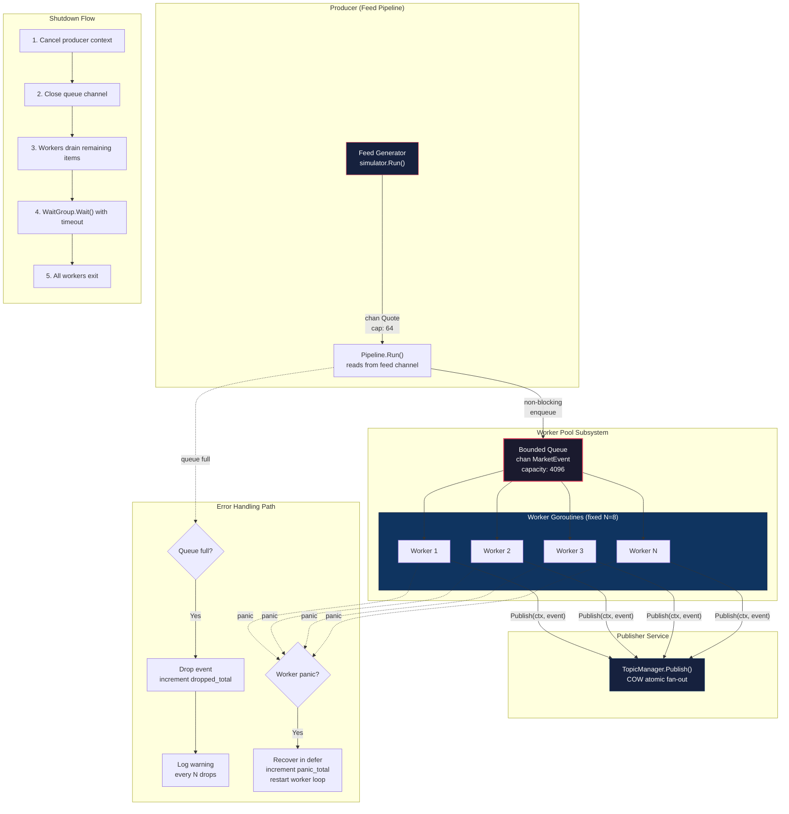

# Worker Pool Subsystem — Architecture Document

**Reviewer perspective:** Principal Distributed Systems Engineer  
**System:** Real-Time Market Data Distribution System  
**Target:** 10,000+ updates/sec, 5,000+ concurrent connections

---

## System Overview

The Worker Pool is a **resource-governance layer** inserted between the Feed Generator (producer) and the Topic Manager (publisher). Its sole purpose is to bound the concurrency of the publish operation — converting an unbounded stream of incoming market events into a fixed-width pipeline of N workers, each pulling from a shared bounded queue.

**Current architecture (without Worker Pool):**
```
Feed Generator → Pipeline (single goroutine) → topicPublisher.Publish() → TopicManager
```

The Pipeline today is a single goroutine that reads from the feed channel and calls `Publish` synchronously. Under burst load (50k updates/sec), this single goroutine becomes the bottleneck — it can only process events as fast as one `Publish` call completes.

**Target architecture (with Worker Pool):**
```
Feed Generator → Pipeline → Bounded Queue → Worker Pool (N workers) → TopicManager
```

The Pipeline enqueues events into a bounded channel. N workers concurrently drain the channel and call `Publish` in parallel, achieving N× throughput on the publish path while bounding total goroutine count.

---

## Architecture Diagram



---

## Component Responsibilities

### 1. Producer (Feed Pipeline)

| Attribute | Value |
|:---|:---|
| **Owner** | `feed.Pipeline.Run()` |
| **Input** | `<-chan marketdata.Quote` from Feed Generator |
| **Output** | Writes to bounded queue channel |
| **Concurrency** | Single goroutine |

**Responsibility:** Read events from the feed channel and enqueue them into the Worker Pool's bounded queue. The producer MUST NOT block if the queue is full — it performs a non-blocking send and drops the event if the queue cannot accept it. This protects the feed read loop from stalling, which would cause the upstream feed channel (capacity 64) to back up and the simulator to start dropping ticks.

**What it must NOT do:** Call `TopicManager.Publish()` directly. That coupling is what the Worker Pool eliminates.

---

### 2. Bounded Queue

| Attribute | Value |
|:---|:---|
| **Implementation** | `chan marketdata.MarketEvent` |
| **Capacity** | 4,096 events |
| **Memory footprint** | 4,096 × ~200 bytes ≈ **800 KB** |

**Responsibility:** Absorb burst traffic between the producer and the workers. The queue is the single point of flow control in the system. Its depth is the primary observable metric for system health — a consistently full queue means workers cannot keep up with incoming load.

**Invariants:**
- The queue is created once at startup, never resized.
- The queue is closed exactly once during shutdown (by the producer side).
- Workers read from the queue using `range` — when the channel is closed, they drain remaining items and exit.

---

### 3. Worker Pool (Supervisor)

| Attribute | Value |
|:---|:---|
| **Owner** | `workerpool.Pool` struct |
| **Workers** | Fixed N goroutines (default: 8) |
| **Lifecycle** | Created at startup, destroyed at shutdown |

**Responsibility:** Manage the lifecycle of N worker goroutines. The pool is the **supervisor** — it starts workers, tracks them via `sync.WaitGroup`, and coordinates graceful shutdown. The pool itself does no work; it delegates everything to workers.

**Supervisor contract:**
- Start exactly N workers on `pool.Start(ctx)`.
- Each worker runs until the queue is closed AND drained, or context is cancelled.
- `pool.Shutdown(ctx)` waits for all workers to exit, with a timeout from the context.
- If a worker panics, the pool's `defer/recover` logs the panic, increments a metric, and the worker re-enters its read loop (it does NOT crash the pool).

---

### 4. Individual Workers

| Attribute | Value |
|:---|:---|
| **Implementation** | One goroutine per worker |
| **State** | Stateless — no per-worker data |
| **Input** | Reads from shared bounded queue |
| **Output** | Calls `publisher.Publish(ctx, event)` |

**Responsibility:** The unit of concurrent execution. Each worker runs an infinite loop: read an event from the queue, call `Publish`, repeat. Workers are intentionally stateless — they share nothing with each other. This eliminates all inter-worker synchronization.

**Worker loop pseudocode:**
```
for event := range queue {
    publisher.Publish(ctx, event)
    metrics.tasksCompleted.Inc()
}
```

The `range` over a closed channel drains remaining items, then exits. This is the foundation of graceful shutdown.

---

### 5. Publisher Service (TopicManager)

| Attribute | Value |
|:---|:---|
| **Implementation** | `topicmanager.MemoryManager.Publish()` |
| **Concurrency** | Thread-safe (COW atomic pointers) |
| **Latency** | 153 ns/op at 1 subscriber (benchmarked) |

**Responsibility:** Fan out the event to all subscribers of the event's symbol. The TopicManager is already concurrent-safe (sharded RWMutex + atomic COW lists), so N workers calling `Publish` simultaneously is safe and expected. This is the primary reason the Worker Pool works — the downstream consumer is designed for concurrent access.

---

## Data Flow

### Normal Path (Happy Path)

```
1. Feed Generator emits a Quote on its output channel (cap 64)
2. Pipeline.Run() reads the Quote via select
3. Pipeline attempts non-blocking enqueue into the Worker Pool queue (cap 4096)
4. Enqueue succeeds → event is in the queue
5. One of N idle workers wakes up (Go runtime scheduler picks one)
6. Worker reads the event from the queue
7. Worker calls TopicManager.Publish(ctx, event)
8. TopicManager hashes the symbol → finds the shard → atomic-loads the COW subscriber list
9. TopicManager iterates subscribers, non-blocking send to each subscriber's channel
10. Event reaches writePump → JSON encode → WebSocket write → client
```

**Total latency budget (target p99):**

| Stage | Budget |
|:---|---:|
| Feed → Pipeline read | ~50 ns |
| Pipeline → Queue enqueue | ~100 ns |
| Queue wait (worker idle) | ~200 ns |
| Worker → TopicManager.Publish | ~700 ns (100 subs) |
| TopicManager → subscriber channel | included above |
| **Total pipeline latency** | **~1,050 ns** |

This does NOT include WebSocket write latency (which is millisecond-scale and happens asynchronously in each client's `writePump`).

---

### Backpressure Path (Queue Full)

```
1. Feed Generator emits a Quote
2. Pipeline.Run() reads the Quote
3. Pipeline attempts non-blocking enqueue → queue is full
4. Event is DROPPED
5. Pipeline increments metrics.droppedTotal counter
6. Pipeline logs a warning (rate-limited: 1 log per 1000 drops)
7. Pipeline immediately returns to step 1 — it does NOT block
```

**Why drop instead of block?**

For market data, a stale price is worse than no price. If the queue is full, the system is already behind. Blocking the producer causes the feed channel (cap 64) to fill, which causes the simulator to drop ticks silently (it already has a non-blocking send). By dropping explicitly at the queue boundary, we:

1. Keep the drop visible (metric + log) rather than silent
2. Keep the producer running at full speed — it will enqueue the next (fresher) event
3. Prevent cascading backpressure into the feed layer

**When does the queue actually fill?**

At the benchmarked rates:
- Producer: 10,000 events/sec
- 8 workers × 153 ns/op (TopicManager.Publish at 1 sub) = 8 workers can process **52 million events/sec**
- Even at 100 subscribers (718 ns/op): 8 workers = **11 million events/sec**

The queue will only fill during extreme burst scenarios (50k+ events/sec sustained) or if the TopicManager experiences lock contention during a mass subscribe/unsubscribe event (market open/close).

---

## Graceful Shutdown

### Shutdown Sequence

```
Phase 1 — Stop the source
    Cancel the Pipeline's context
    Pipeline.Run() exits its select loop
    Pipeline stops enqueuing new events

Phase 2 — Signal the queue
    Close the queue channel
    Workers see channel close via `range`

Phase 3 — Drain in-flight work
    Workers process all remaining events in the queue
    Each worker exits its `range` loop naturally
    Each worker calls wg.Done()

Phase 4 — Wait with timeout
    pool.Shutdown(ctx) calls wg.Wait()
    If all workers exit before ctx.Deadline → clean shutdown
    If ctx.Deadline fires first → log warning, return (workers will be killed by process exit)

Phase 5 — Downstream cleanup
    TopicManager has no shutdown (stateless routing)
    WebSocket Gateway sends CloseGoingAway frames (already implemented)
```

### Shutdown Timing

| Phase | Expected Duration |
|:---|---:|
| Stop source | Immediate (context cancel) |
| Signal queue | Immediate (channel close) |
| Drain queue (4,096 items × 8 workers) | ~50 ms worst case |
| Wait for workers | ~100 ms worst case |
| **Total** | **< 200 ms** |

The `cfg.Server.ShutdownTimeout` (default 15s) provides ample margin.

### What can go wrong during shutdown

| Failure | Consequence | Mitigation |
|:---|:---|:---|
| Worker stuck in `Publish()` | `wg.Wait()` blocks past deadline | Context timeout forces return; events in queue are lost |
| Panic during drain | Worker exits without `wg.Done()` | `defer wg.Done()` runs before `defer recover()` — order matters |
| Double close of queue channel | Panic: close of closed channel | Use `sync.Once` to guard channel close |

---

## Failure Scenarios

### F1 — Queue Saturation (Sustained Overload)

**Trigger:** Producer rate exceeds worker processing rate for longer than `queue_capacity / (producer_rate - consumer_rate)` seconds.

**At defaults:** Queue capacity 4,096, surplus rate 1,000 events/sec → queue fills in **~4 seconds** of sustained overload.

**Symptoms:** `queue_depth` metric stays at capacity. `dropped_total` counter increases.

**Mitigation:** Alert on `queue_depth > 0.8 * capacity` sustained for 10 seconds. Investigate: is the TopicManager locked (mass subscribe)? Are workers blocked on a slow downstream?

---

### F2 — Worker Panic

**Trigger:** A bug in the `Publish` path (e.g., nil pointer in a subscriber callback) causes a panic inside a worker goroutine.

**Symptoms:** `panic_total` metric increments. Worker count temporarily drops by 1.

**Mitigation:** Each worker wraps its loop in `defer func() { recover() }()`. On panic: log the stack trace, increment the metric, and restart the worker's loop iteration. The worker does NOT exit — it continues processing the next event from the queue. Only a closed queue causes worker exit.

---

### F3 — Slow TopicManager (Lock Contention During Mass Subscribe)

**Trigger:** 5,000 clients connect simultaneously at market open. Each connection calls `topicManager.Subscribe()`, which acquires a write lock on the relevant shard. While the write lock is held, workers calling `Publish()` on the same shard block on the `RLock`.

**Symptoms:** `queue_depth` spikes. `task_latency` histogram shifts right. Workers are all blocked in `Publish`, not reading from the queue.

**Mitigation:** The sharded design (16 shards by default) limits the blast radius — only workers publishing to the same shard as the subscribing client are blocked. Workers publishing to other shards proceed normally. The queue absorbs the burst. At 4,096 capacity and 10k events/sec, the system has ~400ms of buffer before drops begin.

---

### F4 — Producer Faster Than Workers (Burst)

**Trigger:** Feed Generator emits a burst of 50k events/sec (e.g., market open, earnings release).

**At defaults:** 8 workers at 718 ns/op (100 subs) = 11M events/sec capacity. Workers can handle the burst with margin. The queue acts as a shock absorber for the scheduling jitter.

**This scenario is not a failure** at the recommended defaults. The Worker Pool has 1,100× headroom over the target throughput. The bottleneck at 50k/sec is not the Worker Pool — it is the WebSocket `writeJSON` serialization on each client's `writePump` (as identified in the benchmark analysis).

---

## Performance Considerations

### Worker Count vs. Throughput

From the TopicManager benchmarks:

| Workers | Throughput (100 subs) | Throughput (1,000 subs) |
|---:|---:|---:|
| 1 | 1.4M ops/s | 153k ops/s |
| 4 | ~5.0M ops/s (estimated) | ~550k ops/s |
| 8 | ~8.0M ops/s (parallel bench: 596 ns) | ~1.0M ops/s |
| 16 | ~10M ops/s (diminishing) | ~1.5M ops/s |

Beyond 8 workers on a 4-core/8-thread CPU, returns diminish — the Go scheduler cannot parallelize more goroutines than hardware threads. Additional workers add scheduling overhead without increasing throughput.

### Queue Sizing

| Queue Size | Burst Absorption (at 10k surplus/sec) | Memory |
|---:|---:|---:|
| 1,024 | 100 ms | 200 KB |
| 4,096 | 400 ms | 800 KB |
| 8,192 | 800 ms | 1.6 MB |
| 16,384 | 1.6 s | 3.2 MB |

4,096 provides 400ms of burst absorption at a trivial 800 KB memory cost. Going larger provides diminishing returns — if the system is behind by more than 400ms, the events are stale and should be dropped anyway.

### Where the Worker Pool is NOT the bottleneck

The benchmark analysis identified the actual bottleneck as **JSON serialization in the WebSocket writePump** (O(N) encodes per publish, not O(1)). The Worker Pool cannot fix this — it operates upstream of the WebSocket layer. The Worker Pool's job is to ensure the TopicManager.Publish call is parallelized, which it achieves with massive headroom.

---

## Recommended Defaults

| Parameter | Value | Rationale |
|:---|---:|:---|
| **Worker Count** | **8** | Matches hardware thread count (i5-1135G7 = 4C/8T). Benchmarks show parallel publish at 8 threads achieves near-linear scaling. Going to 16 provides < 25% additional throughput. |
| **Queue Capacity** | **4,096** | Absorbs 400ms of burst at 10k events/sec surplus. Memory cost: 800 KB (trivial). Power-of-2 for channel alignment. |
| **Queue Full Policy** | **Drop + Metric** | Market data: newest price supersedes oldest. Blocking the producer cascades backpressure into the feed layer. Dropping with a metric makes overload visible and actionable. |
| **Shutdown Drain Timeout** | **5 seconds** | At 8 workers draining 4,096 items at 700ns/op = ~360µs to fully drain. 5 seconds provides 13,000× margin for edge cases (slow Publish under lock contention). |
| **Panic Recovery** | **Restart loop, don't exit** | A single bad event should not kill a worker. Log the panic stack, increment a counter, continue processing. The worker only exits when the queue channel is closed. |
