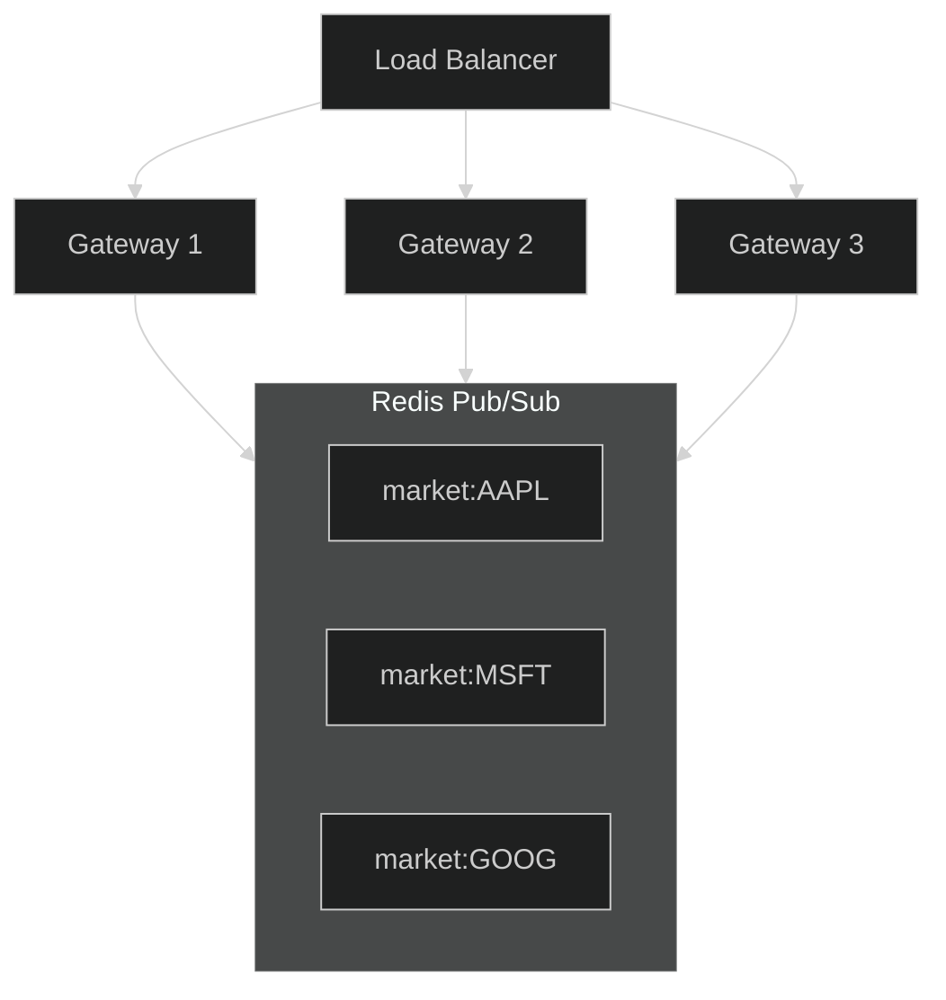

# Multi-Gateway Architecture

```mermaid
%%{init: {'theme': 'dark'}}%%
flowchart TD
    LB["Load Balancer"]

    LB --> GW1["Gateway 1"]
    LB --> GW2["Gateway 2"]
    LB --> GW3["Gateway 3"]

    GW1 --> Redis
    GW2 --> Redis
    GW3 --> Redis

    subgraph Redis ["Redis Pub/Sub"]
        CH1["market:AAPL"]
        CH2["market:MSFT"]
        CH3["market:GOOG"]
    end
```
