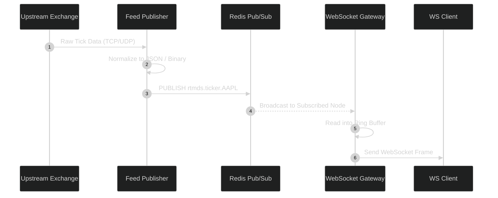
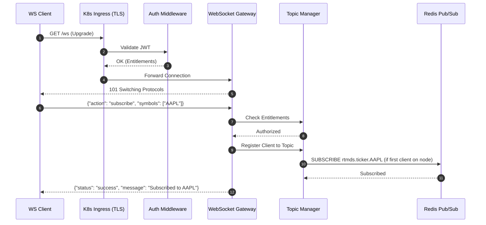
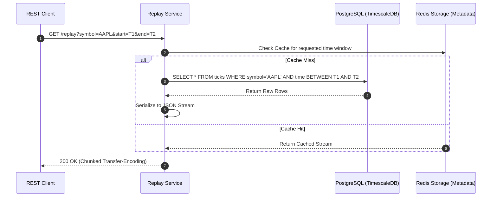

# RTMDS Core Sequence Diagrams

This document contains the critical sequence diagrams illustrating the flow of data through the Real-Time Market Data System.

## 1. Market Data Publication & Fan-Out

This diagram shows how a tick originates at an upstream exchange, is normalized by the Publisher, routed across the Redis Pub/Sub cluster, and ultimately broadcast to connected WebSocket clients.

## 2. Client Subscription Workflow

This diagram illustrates the process of a client establishing a connection, authenticating, and subscribing to a topic.

## 3. Time-Travel Replay Workflow

This diagram shows how the system handles historical data requests via the Replay API.

