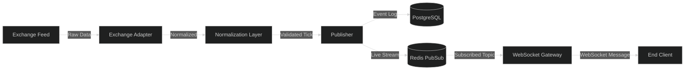

# Market Data Flow

```mermaid
%%{init: {'theme': 'dark'}}%%
flowchart LR
    Exchange[Exchange Feed] -->|Raw Data| Adapter[Exchange Adapter]
    Adapter -->|Normalized| Normalizer[Normalization Layer]
    Normalizer -->|Validated Tick| Publisher[Publisher]
    Publisher -->|Event Log| EventStore[(PostgreSQL)]
    Publisher -->|Live Stream| Redis[(Redis PubSub)]
    Redis -->|Subscribed Topic| Gateway[WebSocket Gateway]
    Gateway -->|WebSocket Message| Client[End Client]
```
