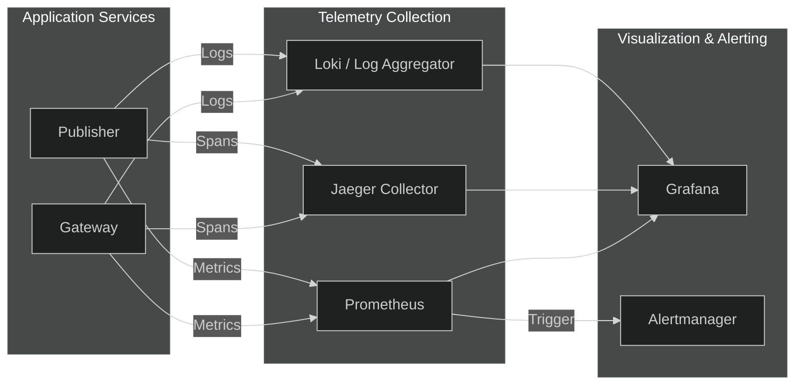

# Observability Pipeline

```mermaid
%%{init: {'theme': 'dark'}}%%
flowchart LR
    subgraph "Application Services"
        GW[Gateway]
        Pub[Publisher]
    end

    subgraph "Telemetry Collection"
        Prom[Prometheus]
        Jaeger[Jaeger Collector]
        Loki[Loki / Log Aggregator]
    end

    subgraph "Visualization & Alerting"
        Grafana[Grafana]
        AlertMgr[Alertmanager]
    end

    GW -->|Metrics| Prom
    Pub -->|Metrics| Prom
    GW -->|Spans| Jaeger
    Pub -->|Spans| Jaeger
    GW -->|Logs| Loki
    Pub -->|Logs| Loki

    Prom --> Grafana
    Jaeger --> Grafana
    Loki --> Grafana
    Prom -->|Trigger| AlertMgr
```
