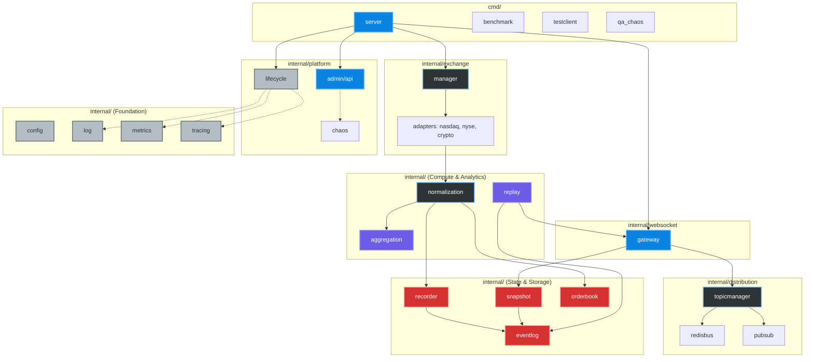

# Package Dependencies Diagram

This diagram visualizes the architectural boundaries and dependencies between the core internal packages of the Real Time Market Data System (RTMDS).

```mermaid
graph TD
    %% Core Commands
    subgraph Cmd ["cmd/"]
        Server[server]
        Benchmark[benchmark]
        TestClient[testclient]
        QA_Chaos[qa_chaos]
    end

    %% Edge & Distribution
    subgraph Edge ["internal/websocket"]
        Gateway[gateway]
    end

    subgraph Distribution ["internal/distribution"]
        TopicManager[topicmanager]
        RedisBus[redisbus]
        PubSub[pubsub]
    end

    %% State & Storage
    subgraph State ["internal/ (State & Storage)"]
        EventLog[eventlog]
        Snapshot[snapshot]
        Recorder[recorder]
        OrderBook[orderbook]
    end

    %% Compute & Analytics
    subgraph Compute ["internal/ (Compute & Analytics)"]
        Normalization[normalization]
        Aggregation[aggregation]
        Replay[replay]
    end

    %% Ingestion
    subgraph Ingestion ["internal/exchange"]
        FeedManager[manager]
        Adapters[adapters: nasdaq, nyse, crypto]
    end

    %% Platform & Foundation
    subgraph Platform ["internal/platform"]
        Lifecycle[lifecycle]
        AdminAPI[admin/api]
        Chaos[chaos]
    end

    subgraph Foundation ["internal/ (Foundation)"]
        Config[config]
        Log[log]
        Metrics[metrics]
        Tracing[tracing]
    end

    %% Dependencies
    Server --> Lifecycle
    Server --> Gateway
    Server --> FeedManager
    Server --> AdminAPI

    Gateway --> TopicManager
    Gateway --> Snapshot

    TopicManager --> RedisBus
    TopicManager --> PubSub

    FeedManager --> Adapters
    Adapters --> Normalization

    Normalization --> OrderBook
    Normalization --> Aggregation
    Normalization --> Recorder

    Recorder --> EventLog
    Snapshot --> EventLog
    Replay --> EventLog
    Replay --> Gateway

    %% Cross-cutting concerns
    AdminAPI -.-> Chaos
    Lifecycle -.-> Log
    Lifecycle -.-> Metrics
    Lifecycle -.-> Tracing

    classDef core fill:#2d3436,stroke:#74b9ff,stroke-width:2px,color:#fff;
    classDef edge fill:#0984e3,stroke:#74b9ff,stroke-width:2px,color:#fff;
    classDef state fill:#d63031,stroke:#fab1a0,stroke-width:2px,color:#fff;
    classDef compute fill:#6c5ce7,stroke:#a29bfe,stroke-width:2px,color:#fff;
    classDef foundation fill:#b2bec3,stroke:#636e72,stroke-width:2px,color:#2d3436;

    class Server,Gateway,AdminAPI edge;
    class TopicManager,Normalization,FeedManager core;
    class EventLog,Snapshot,Recorder,OrderBook state;
    class Aggregation,Replay compute;
    class Config,Log,Metrics,Tracing,Lifecycle foundation;
```
