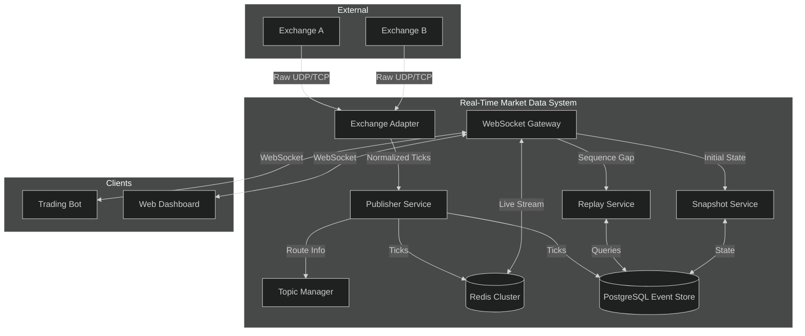

# System Architecture

```mermaid
%%{init: {'theme': 'dark'}}%%
flowchart TB
    subgraph External
        E1[Exchange A]
        E2[Exchange B]
    end

    subgraph "Real-Time Market Data System"
        Adapter[Exchange Adapter]
        Publisher[Publisher Service]
        TopicMgr[Topic Manager]
        Redis[(Redis Cluster)]
        Gateway[WebSocket Gateway]
        Replay[Replay Service]
        Snapshot[Snapshot Service]
        EventStore[(PostgreSQL Event Store)]
    end

    subgraph Clients
        C1[Trading Bot]
        C2[Web Dashboard]
    end

    E1 -->|Raw UDP/TCP| Adapter
    E2 -->|Raw UDP/TCP| Adapter
    Adapter -->|Normalized Ticks| Publisher
    Publisher -->|Route Info| TopicMgr
    Publisher -->|Ticks| Redis
    Publisher -->|Ticks| EventStore
    Gateway <-->|Live Stream| Redis
    Gateway <-->|WebSocket| C1
    Gateway <-->|WebSocket| C2
    Replay <-->|Queries| EventStore
    Snapshot <-->|State| EventStore
    Gateway -->|Sequence Gap| Replay
    Gateway -->|Initial State| Snapshot
```
