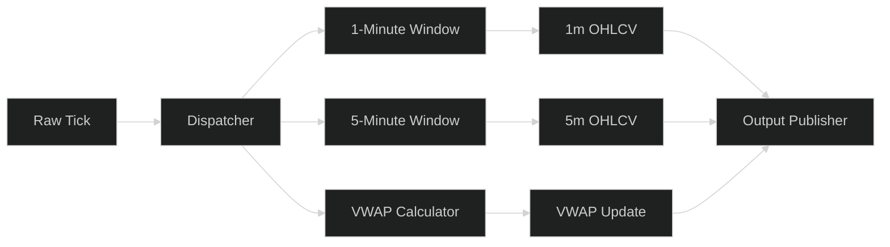

# Aggregation Engine Flow

```mermaid
%%{init: {'theme': 'dark'}}%%
flowchart LR
    Tick[Raw Tick] --> Dispatcher[Dispatcher]
    Dispatcher --> Window1m[1-Minute Window]
    Dispatcher --> Window5m[5-Minute Window]
    Dispatcher --> VWAP[VWAP Calculator]
    
    Window1m --> Candle1[1m OHLCV]
    Window5m --> Candle5[5m OHLCV]
    VWAP --> VWAPData[VWAP Update]
    
    Candle1 --> Output[Output Publisher]
    Candle5 --> Output
    VWAPData --> Output
```
