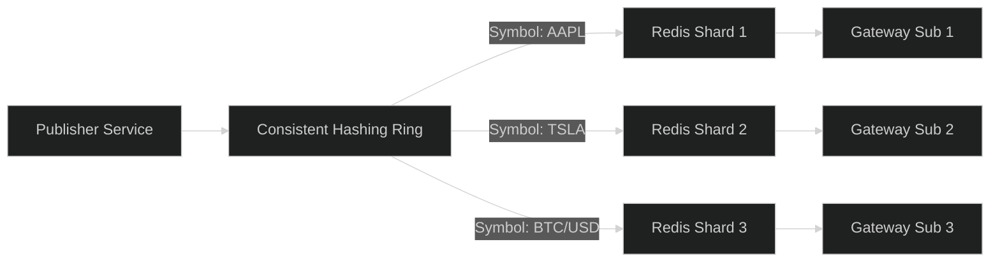

# Topic Manager Architecture

```mermaid
%%{init: {'theme': 'dark'}}%%
flowchart LR
    Publisher[Publisher Service] --> HashRing[Consistent Hashing Ring]
    HashRing -->|Symbol: AAPL| Shard1[Redis Shard 1]
    HashRing -->|Symbol: TSLA| Shard2[Redis Shard 2]
    HashRing -->|Symbol: BTC/USD| Shard3[Redis Shard 3]
    
    Shard1 --> GatewayA[Gateway Sub 1]
    Shard2 --> GatewayB[Gateway Sub 2]
    Shard3 --> GatewayC[Gateway Sub 3]
```
