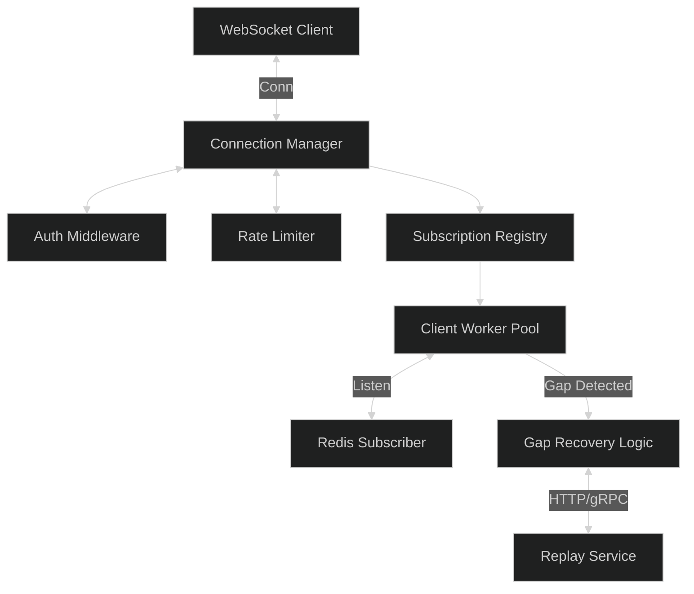

# WebSocket Gateway Architecture

```mermaid
%%{init: {'theme': 'dark'}}%%
flowchart TB
    Client[WebSocket Client] <-->|Conn| ConnHandler[Connection Manager]
    ConnHandler <--> Auth[Auth Middleware]
    ConnHandler <--> RateLimit[Rate Limiter]
    
    ConnHandler --> SubRegistry[Subscription Registry]
    SubRegistry --> WorkerPool[Client Worker Pool]
    
    WorkerPool <-->|Listen| RedisSub[Redis Subscriber]
    WorkerPool -->|Gap Detected| GapHandler[Gap Recovery Logic]
    GapHandler <-->|HTTP/gRPC| Replay[Replay Service]
```
