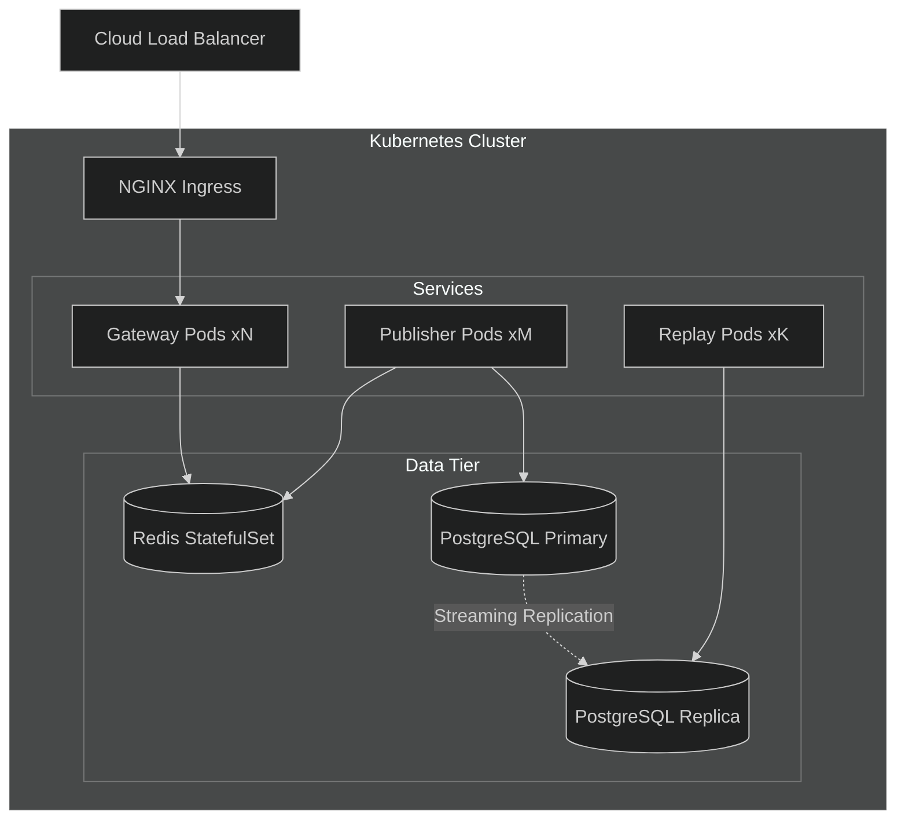

# Deployment Architecture

```mermaid
%%{init: {'theme': 'dark'}}%%
flowchart TB
    subgraph Kubernetes Cluster
        Ingress[NGINX Ingress]
        
        subgraph Services
            GW[Gateway Pods xN]
            Pub[Publisher Pods xM]
            Rep[Replay Pods xK]
        end
        
        subgraph Data Tier
            Redis[(Redis StatefulSet)]
            PG[(PostgreSQL Primary)]
            PG_Replica[(PostgreSQL Replica)]
        end
    end

    LoadBalancer[Cloud Load Balancer] --> Ingress
    Ingress --> GW
    GW --> Redis
    Pub --> Redis
    Pub --> PG
    Rep --> PG_Replica
    PG -.->|Streaming Replication| PG_Replica
```
