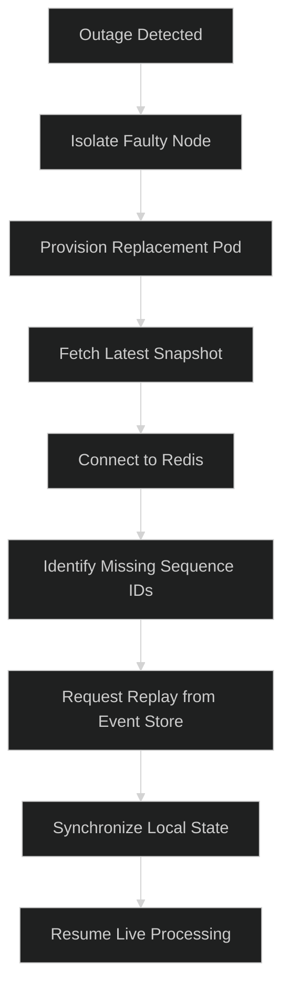

# Recovery Workflow

```mermaid
%%{init: {'theme': 'dark'}}%%
flowchart TD
    Detect[Outage Detected] --> Isolate[Isolate Faulty Node]
    Isolate --> SpinUp[Provision Replacement Pod]
    SpinUp --> FetchSnap[Fetch Latest Snapshot]
    FetchSnap --> Connect[Connect to Redis]
    Connect --> IdentifyGap[Identify Missing Sequence IDs]
    IdentifyGap --> Replay[Request Replay from Event Store]
    Replay --> Sync[Synchronize Local State]
    Sync --> Live[Resume Live Processing]
```
