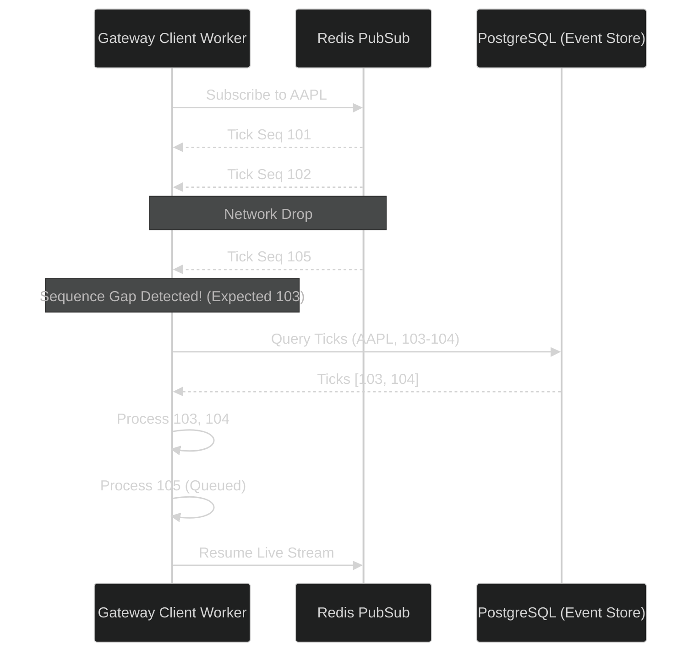

# Replay Sequence

```mermaid
%%{init: {'theme': 'dark'}}%%
sequenceDiagram
    participant C as Gateway Client Worker
    participant R as Redis PubSub
    participant P as PostgreSQL (Event Store)
    
    C->>R: Subscribe to AAPL
    R-->>C: Tick Seq 101
    R-->>C: Tick Seq 102
    Note over C,R: Network Drop
    R-->>C: Tick Seq 105
    Note over C: Sequence Gap Detected! (Expected 103)
    C->>P: Query Ticks (AAPL, 103-104)
    P-->>C: Ticks [103, 104]
    C->>C: Process 103, 104
    C->>C: Process 105 (Queued)
    C->>R: Resume Live Stream
```
