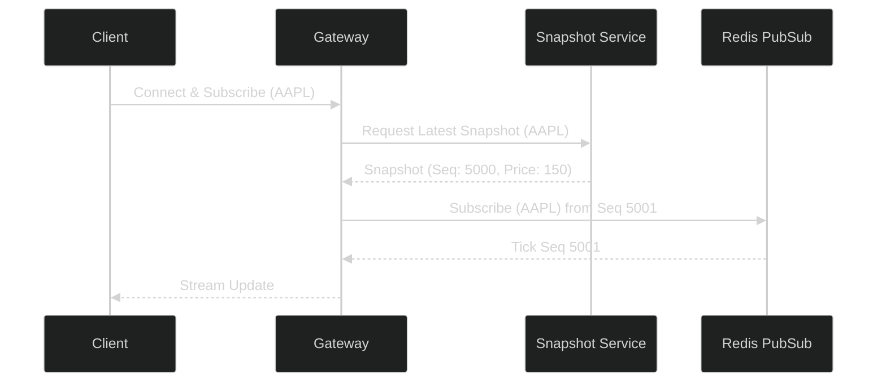

# Snapshot Flow

```mermaid
%%{init: {'theme': 'dark'}}%%
sequenceDiagram
    participant C as Client
    participant GW as Gateway
    participant SS as Snapshot Service
    participant R as Redis PubSub
    
    C->>GW: Connect & Subscribe (AAPL)
    GW->>SS: Request Latest Snapshot (AAPL)
    SS-->>GW: Snapshot (Seq: 5000, Price: 150)
    GW->>R: Subscribe (AAPL) from Seq 5001
    R-->>GW: Tick Seq 5001
    GW-->>C: Stream Update
```
