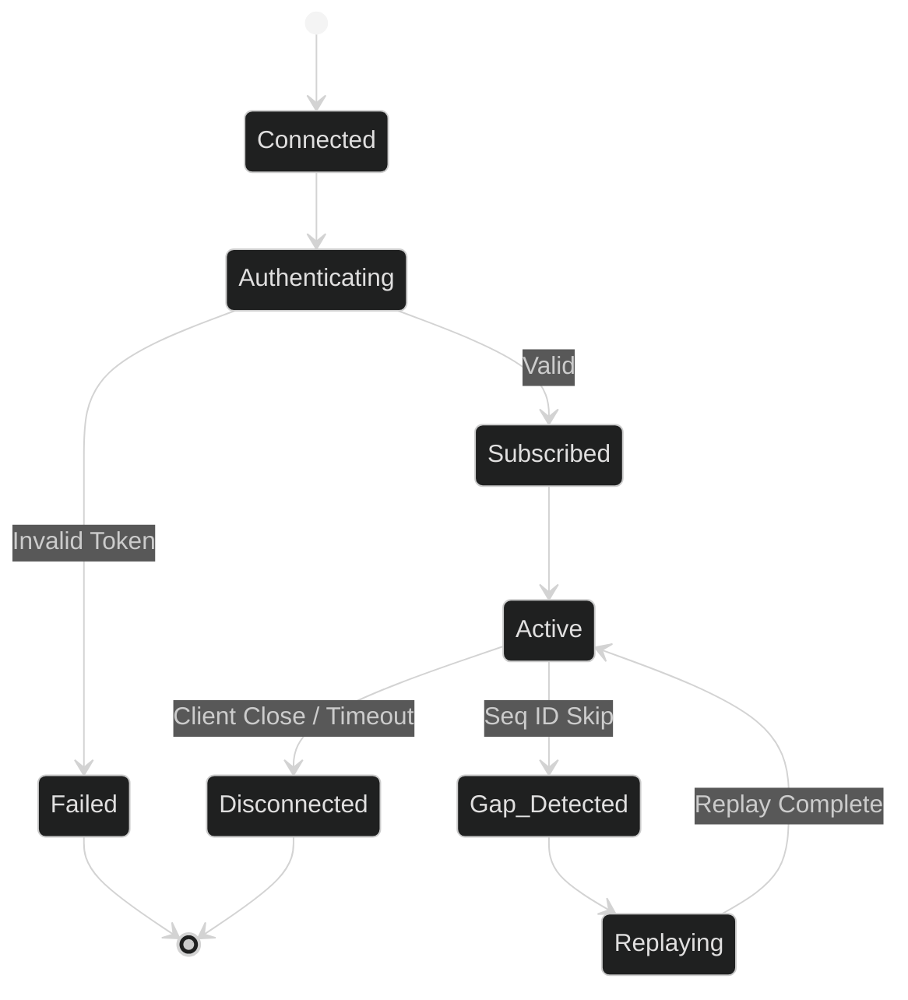

# Client Connection Lifecycle

```mermaid
%%{init: {'theme': 'dark'}}%%
stateDiagram-v2
    [*] --> Connected
    Connected --> Authenticating
    Authenticating --> Failed: Invalid Token
    Failed --> [*]
    Authenticating --> Subscribed: Valid
    Subscribed --> Active
    Active --> Gap_Detected: Seq ID Skip
    Gap_Detected --> Replaying
    Replaying --> Active: Replay Complete
    Active --> Disconnected: Client Close / Timeout
    Disconnected --> [*]
```
