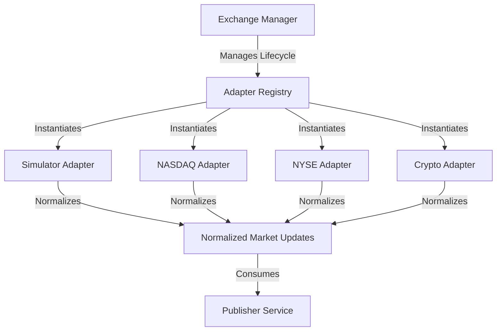

# Exchange Adapter Framework Implementation Plan

This document outlines the architecture and step-by-step implementation plan for the **Exchange Adapter Framework**.

The goal is to replace the single Feed Generator with a pluggable, scalable architecture that supports multiple concurrent exchange feeds (e.g., NASDAQ, NYSE, Crypto) while remaining entirely decoupled from the core publisher pipeline.

## User Review Required
> [!IMPORTANT]
> Please review the architecture and proposed package structure below. The framework relies heavily on Dependency Injection and Interface Contracts, preventing exchange-specific logic from leaking into the core application.

## Open Questions
> [!WARNING]
> 1. For the mock adapters (NASDAQ, NYSE, Crypto), should they generate purely random data like the current simulator, or should they replay from a static JSON/CSV file for more deterministic testing?
> 2. Should we update the main `cmd/server/main.go` to instantly load all 4 adapters concurrently by default, or just the Simulator?

## Proposed Architecture

## Proposed Changes

---

### Core Framework (internal/exchange)

The framework orchestrates adapter lifecycles without knowing protocol specifics.

#### [NEW] [interfaces.go](file:///e:/Sumit%20Codes/Season/GS_Summer_Analyst_27/Real%20Time%20Market%20Data%20System/internal/exchange/interfaces.go)
Defines the `ExchangeAdapter` contract (Connect, Subscribe, Run, Stop) and `AdapterFactory`.
#### [NEW] [config.go](file:///e:/Sumit%20Codes/Season/GS_Summer_Analyst_27/Real%20Time%20Market%20Data%20System/internal/exchange/config.go)
Defines uniform YAML/JSON configuration structs for adapter credentials, endpoints, and retry policies.
#### [NEW] [registry.go](file:///e:/Sumit%20Codes/Season/GS_Summer_Analyst_27/Real%20Time%20Market%20Data%20System/internal/exchange/registry.go)
A concurrent-safe mapping of adapter names to their factories.
#### [NEW] [manager.go](file:///e:/Sumit%20Codes/Season/GS_Summer_Analyst_27/Real%20Time%20Market%20Data%20System/internal/exchange/manager.go)
Orchestrates the lifecycle, injecting dependencies (loggers, metrics) and catching fatal adapter panics to prevent full system crashes.

---

### Concrete Adapters (internal/adapters)

#### [NEW] [simulator/adapter.go](file:///e:/Sumit%20Codes/Season/GS_Summer_Analyst_27/Real%20Time%20Market%20Data%20System/internal/adapters/simulator/adapter.go)
Refactors the current standalone `feed.Generator` into a fully compliant `ExchangeAdapter`.
#### [NEW] [nasdaq/adapter.go](file:///e:/Sumit%20Codes/Season/GS_Summer_Analyst_27/Real%20Time%20Market%20Data%20System/internal/adapters/nasdaq/adapter.go)
Mock implementation representing a TCP/ITCH-style equity feed.
#### [NEW] [nyse/adapter.go](file:///e:/Sumit%20Codes/Season/GS_Summer_Analyst_27/Real%20Time%20Market%20Data%20System/internal/adapters/nyse/adapter.go)
Mock implementation representing a FIX-style equity feed.
#### [NEW] [crypto/adapter.go](file:///e:/Sumit%20Codes/Season/GS_Summer_Analyst_27/Real%20Time%20Market%20Data%20System/internal/adapters/crypto/adapter.go)
Mock implementation representing a WebSocket-style crypto feed (Binance/Coinbase style).

---

### Integration

#### [MODIFY] [internal/marketdata/feed.go](file:///e:/Sumit%20Codes/Season/GS_Summer_Analyst_27/Real%20Time%20Market%20Data%20System/internal/marketdata/feed.go)
Deprecate or alias to align with the new `exchange.ExchangeAdapter` interface.
#### [MODIFY] [cmd/server/main.go](file:///e:/Sumit%20Codes/Season/GS_Summer_Analyst_27/Real%20Time%20Market%20Data%20System/cmd/server/main.go)
Initialize the `ExchangeManager`, register the 4 adapters, and wire them up to the Publisher pipeline.

---

## Verification Plan

### Automated Tests
- Unit tests for `ExchangeManager` testing startup/shutdown isolation (if one adapter fails, others stay up).
- Unit tests for every adapter mocking the underlying connections.
- Micro-benchmarks for adapter throughput.

### Manual Verification
- Deploying locally using `go run cmd/server/main.go` and subscribing to `NASDAQ` and `CRYPTO` symbols concurrently via a WebSocket client to verify data from both exchanges merges flawlessly in the event log.
